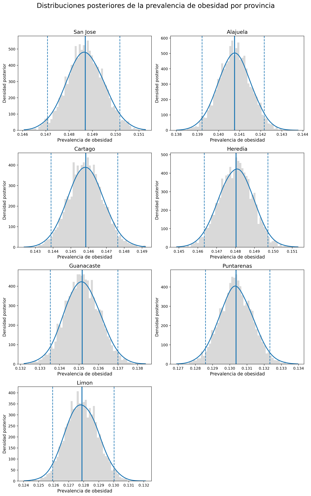
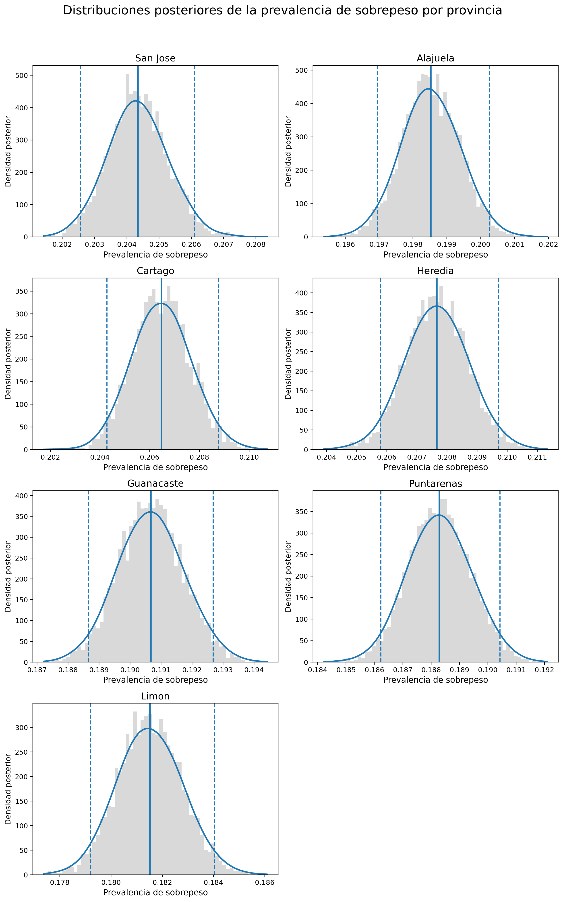

```{r setup, include=FALSE}
knitr::opts_chunk$set(echo = FALSE, message = FALSE, warning = FALSE)
```

# Introducción

El sobrepeso y la obesidad infantil se han establecido en las últimas décadas como una de las principales problemáticas de salud pública a nivel mundial. En tan solo cuatro décadas, la cantidad de niños y adolescentes en edad escolar con obesidad se multiplicó por más de diez, pasando de 11 millones a 124 millones, y se calculó que alrededor de 216 millones tenían sobrepeso en el 2016 [@WHO2018]. Entre los efectos tempranos de estas afecciones, se incluyen complicaciones respiratorias, alteraciones metabólicas y problemas psicosociales, mientras que en la adultez se asocia con mayor riesgo de enfermedades crónicas, discapacidad y mortalidad prematura [@Gamboa2021].

En Costa Rica, los resultados del Censo Escolar de Peso y Talla 2016 revelaron que más de un tercio de la población infantil en edad escolar presenta sobrepeso u obesidad [@Gomez2023], lo que muestra urgencia de comprender este fenómeno en su complejidad de factores. Del mismo modo en otros países de ingresos medios, el exceso de peso infantil no se distribuye de manera uniforme debido a factores demográficos, socioeconómicos y territoriales que influyen en la prevalencia y configuran escenarios particulares según la zona de residencia, el nivel de desarrollo del distrito o el tipo de centro educativo [@Gamboa2021].

La evidencia científica en Costa Rica ha informado de la magnitud del problema y de los factores que explican sus diferencias territoriales y sociales. @Gamboa2021 analizaron más de 347 000 escolares del Censo Nacional de Peso/Talla 2016, revelando que el 34 % de los niños presentaban exceso de peso, con mayor prevalencia en varones y en aquellos que asistían a escuelas privadas, vivían en zonas urbanas o en distritos con mayor desarrollo socioeconómico. Estos resultados contrastan con la tendencia vista en países desarrollados, donde la obesidad infantil se asocia más a niveles socioeconómicos bajos, lo que subraya la necesidad de analizar el fenómeno junto con el contexto nacional.

Por su parte, @Nunez2022 aportaron referencias nacionales de índice de masa corporal (IMC) y circunferencia de cintura (CC) para estudiantes de 7 a 17 años, mostrando que el 16,3 % de los escolares tenían obesidad y el 26,2 % sobrepeso. Sus hallazgos mostraron contradicciones con los patrones internacionales, lo que evidencia que el uso exclusivo de referencias externas podría distorsionar la prevalencia real en el país; lo que confirma que contar con curvas nacionales de crecimiento es una herramienta fundamental para el monitoreo y diseño de estrategias de salud pública.

En el ámbito regional, @Hernandez2016 evidenciaron en Perú cómo el sobrepeso y la obesidad infantil se concentran en distritos urbanos y costeros, mientras que las zonas andinas y amazónicas registran menores prevalencias. Dicho patrón geográfico refleja la transición nutricional que caracteriza a América Latina, donde coexisten problemas de desnutrición y exceso de peso, situación que hace más compleja la planificación de políticas públicas.

De manera más específica para Costa Rica, @Gomez2023 aplicaron un modelo espacial bayesiano para estimar la prevalencia distrital de obesidad infantil, encontrando asociaciones significativas con factores educativos, económicos y demográficos. Entre los resultados se identificó una relación no lineal con la escolaridad promedio, así como una mayor prevalencia en distritos urbanos, cabeceras de provincia, zonas turísticas y fronterizas con Panamá. Estos hallazgos muestran que los entornos sociales y territoriales influyen de manera decisiva en la distribución del sobrepeso y la obesidad infantil.

Este panorama motiva la siguiente pregunta de investigación: ¿cómo se distribuye territorialmente la prevalencia de sobrepeso y obesidad infantil en Costa Rica, y con qué grado de incertidumbre podemos estimarla a partir de la evidencia disponible? Para responderla, en este estudio adoptamos un enfoque bayesiano explícito en la cuantificación de la incertidumbre y nos proponemos, primero, estimar la distribución posterior de la prevalencia de sobrepeso y de obesidad en cada provincia mediante un modelo binomial bayesiano y métodos computacionales de inferencia; cuando corresponda, se emplearán algoritmos de muestreo eficientes como NUTS/HMC para garantizar una exploración adecuada del espacio posterior [@HoffmanGelman2014]. En segundo lugar, compararemos los resultados entre provincias, analizando medias posteriores e intervalos de credibilidad, con el fin de evaluar la heterogeneidad territorial. Finalmente, visualizaremos la prevalencia estimada y su incertidumbre posterior mediante mapas y gráficos que faciliten la interpretación y comunicación de los hallazgos a audiencias técnicas y de política pública.


*Palabras clave:* Costa Rica, sobrepeso, obesidad

# Metodología
## Descripción de los datos

La base de datos empleada contiene indicadores socioeconómicos y demográficos por distrito, así como medidas de prevalencia de sobrepeso y obesidad infantil. La fuente primaria de información es el Primer Censo Escolar Peso/Talla del 2016, una iniciativa que recolectó datos antropométricos de 347.379 niños entre 6 y 12 años pertenecientes al sistema escolar público y privado de Costa Rica. La información se encuentra desagregada en unidades administrativas (provincias, cantones y distritos). Para este estudio se seleccionaron las provincias como unidad de análisis.

Las variables consideradas en el análisis se describen a continuación:

- **distrito**: Nombre del distrito al que corresponde el registro.

- **provincia**: Nombre de la provincia correspondiente.

- **canton**: Nombre del cantón correspondiente. Representa la unidad territorial principal de análisis.

- **condicion**: Clasificación de los casos según el estado nutricional: sobrepeso, obesidad o combinada.

- **total**: Total de personas observadas.

- **subtotal**: Número de casos registrados por cantón dentro de cada categoría específica de condición.

- **prevalencia**: Porcentaje de la población del cantón que presenta sobrepeso, obesidad o ambas.

- **desempleo**: Porcentaje de personas desempleadas dentro del cantón.

- **poblacion_urbana**: Porcentaje de la población que reside en áreas urbanas del cantón.

- **privacion_critica**: Porcentaje de población en situación de privación crítica.

- **poblacion_menor_14**: Porcentaje de personas menores de 14 años en la población total del cantón.

- **hogares_monomarentales**: Porcentaje de hogares encabezados por un solo padre o madre.

- **ocupantes_por_hogar**: Promedio de personas que habitan en cada hogar del cantón.

- **anos_escolaridad**: Promedio de años de escolaridad alcanzados por la población, indicador del nivel educativo.

## Análisis exploratorio de la base de datos

En términos generales, la prevalencia combinada de sobrepeso y obesidad infantil muestra una media del 34%, con valores entre 13% y 56%, reflejando una variabilidad importante entre distritos. Al desagregar, la prevalencia de sobrepeso presenta un promedio de 20%, con una desviación estándar del 3% y un rango entre 6 y 33%, mientras que la prevalencia de obesidad registra un promedio de 14%, con desviación estándar del 4% y valores entre 0 y 33%. Estos resultados evidencian que, aunque ambas condiciones están presentes en magnitudes considerables, el sobrepeso es más frecuente que la obesidad, lo cual no es sorprendente al considerar que la obesidad se puede interpretar como un caso extremo de sobrepeso.

Los años de escolaridad promedio por distrito se sitúan en 8.1 años, con una dispersión moderada $sd \approx 1.5$. La tasa de desempleo es baja en promedio (3%), pero con algunos distritos alcanzando valores cercanos a 9%. El porcentaje de hogares monomarentales ronda el 20% y la privación crítica promedio de los hogares se ubica en 29%, mostrando casos extremos de hasta 90% La población urbana evidencia una clara polarización: muchos distritos son predominantemente rurales (0%) o completamente urbanos (100%).

### Enfoque Bayesiano
Dada la naturaleza de los datos, se modela el número total de casos observados en cada categoría (sobrepeso y obesidad, respectivamente) mediante una distribución $Y \sim \text{Binom}(N,p)$, donde $Y$ es el número total de casos, N el tamaño de la muestra y $p$ la probabilidad de pertenecer a la categoría de sobrepeso (o bien, obesidad) independientemente de la pertenencia provincial o cantonal. Desde un enfoque bayesiano, se asigna una distribución previa $\pi \sim \text{Beta}(1,1)$. De esta forma, se estima la prevalencia de obesidad y sobrepeso infantil en Costa Rica, a través del algoritmo Metropolis-Hastings.

#### Autocorrelación
Para el método de Metropolis-Hasting, en ambos casos, se obtuvo una alta autocorrelación entre los elementos de la cadena, como se aprecia en las siguientes figuras.

```{r fig-autocorr_obesidad, echo=FALSE, fig.pos='H', fig.align='center', out.width='70%', fig.cap="Distribución posterior de la prevalencia de sobrepeso infantil"}
knitr::include_graphics("../res/graficos/autocorr_obesidad.png")
```

```{r fig-autocorr_sobrepeso, echo=FALSE, fig.pos='H', fig.align='center', out.width='70%', fig.cap="Distribución posterior de la prevalencia de sobrepeso infantil"}
knitr::include_graphics("../res/graficos/autocorr_sobrepeso.png")
```

#### Histogramas
Una vez finalizado el proceso, se realizaron histogramas para visualizar la distribución posterior obtenida a partir de esta metodología. Además, se presenta la media y el intervalo de confianza para cada categoría.

```{r fig-sobpreso, echo=FALSE, fig.pos='H', fig.align='center', out.width='70%', fig.cap="Distribución posterior de la prevalencia de sobrepeso infantil"}
knitr::include_graphics("../res/graficos/hist_post_sobrepeso.png")
```

```{r fig-obesidad, echo=FALSE,fig.pos='H', fig.align='center', out.width='70%', fig.cap="Distribución posterior de la prevalencia de obesidad infantil"}
knitr::include_graphics("../res/graficos/hist_post_obesidad.png")
```


Los histogramas permiten identificar distribuciones relativamente simétricas para variables como años de escolaridad, hogares monomarentales y ocupantes por hogar, mientras que otras como la población urbana y la privación crítica presentan asimetrías y valores extremos.

En cuanto a las asociaciones bivariadas, se observan patrones relevantes:

- Existe una relación positiva entre la prevalencia de sobrepeso/obesidad y los años de escolaridad promedio (los distritos con mayor escolaridad tienden a reportar mayor prevalencia).

- La relación con la tasa de desempleo es débil y ligeramente negativa, indicando que este factor no parece estar fuertemente vinculado con la prevalencia.

- El porcentaje de población urbana muestra una asociación positiva con la prevalencia, aunque con dispersión considerable.

Finalmente, al comparar por provincia, la prevalencia combinada oscila entre 30% en Limón y 37% en Heredia, siendo esta última la más alta. Los boxplots confirman una mayor heterogeneidad en provincias como San José y Alajuela, mientras que Cartago y Guanacaste presentan distribuciones más concentradas.

## Fundamento Teórico
### Hamiltonian Monte Carlo

Hamiltonian Monte Carlo (HMC) es un método de Monte Carlo por cadenas de Markov que introduce variables auxiliares de momento para transformar el muestreo de la distribución posterior \(p(\theta\mid y)\) en la integración de un sistema hamiltoniano. Se define la energía potencial \(U(\theta)=-\log p(\theta\mid y)\) y la energía cinética \(K(r)=\tfrac12 r^\top M^{-1} r\) para un vector de momentos \(r\) y una matriz de masa \(M\). La dinámica hamiltoniana preserva volumen y energía, y se aproxima con el integrador leapfrog, que usa un tamaño de paso \(\epsilon\) y un número de pasos \(L\) para proponer estados $\theta^*,r^*)$ alejados del estado actual, evitando la caminata aleatoria. La propuesta se corrige con un paso de aceptación Metropolis con probabilidad \(\min\{1,\exp[-\Delta H]\}\), donde \(\Delta H\) es el cambio en la energía debido a la discretización. Esta construcción aprovecha gradientes del log-posterior, permitiendo trayectorias largas con baja autocorrelación y alto tamaño efectivo de muestra por evaluación del gradiente. En la práctica, el rendimiento depende de sintonizar \(\epsilon\), \(L\) y \(M\); tamaños de paso demasiado grandes inducen divergencias, mientras que tamaños de paso muy pequeños incrementan el costo computacional. La literatura recomienda adaptar \(\epsilon\) hacia una tasa de aceptación objetivo y adaptar \(M\) (diagonal o densa) para adecuar la escala y curvatura del posterior, mejorando la estabilidad y la mezcla de la cadena [@HoffmanGelman2014].

### NUTS

El No-U-Turn Sampler (NUTS) es una extensión adaptativa de HMC que elimina la necesidad de fijar manualmente la longitud de trayectoria. En lugar de elegir un \(L\) fijo, NUTS expande dinámicamente la trayectoria (mediante un árbol binario) hasta detectar una no-u-turn: el punto en que la dirección del movimiento comienza a invertirse y proseguir añadiría recorrido redundante. Esta regla de detención garantiza trayectorias lo suficientemente largas para explorar eficientemente la masa de probabilidad, pero no tan largas como para desperdiciar cómputo, reduciendo la autocorrelación sin requerir sintonía manual de \(L\) [@HoffmanGelman2014, p. 3, p. 10]. En paralelo, NUTS emplea dual averaging para adaptar el tamaño de paso \(\epsilon\) hacia una tasa de aceptación objetivo (usualmente entre 0.8 y 0.95), lo que disminuye la incidencia de divergencias en posteriors con alta curvatura. En modelos con enlace logit y covariables estandarizadas —como el logit-binomial descrito— los gradientes están bien definidos y escalados, de modo que NUTS puede construir trayectorias estables que recorren el posterior con bajo error de integración y buena mezcla entre cadenas. La combinación de la expansión sin u-turn y la adaptación de \(\epsilon\) produce un muestreo eficiente y reproducible, con diagnósticos de convergencia favorables (\(\hat{R}\) cercano a 1 y tamaños efectivos altos), en línea con las recomendaciones metodológicas de @HoffmanGelman2014.


### Logit-binomial

El modelo logit-binomial describe conteos de “éxitos” \(y_i\) sobre exposiciones \(n_i\) mediante una verosimilitud binomial y un enlace logit para la probabilidad \(p_i\):
\[
y_i \sim \mathrm{Binomial}(n_i, p_i),\qquad
\mathrm{logit}(p_i)=\eta_i=\alpha + X_i^\top\beta.
\]
La función logit es \(\mathrm{logit}(p)=\log\!\big(\tfrac{p}{1-p}\big)\) y su inversa es
\[
p_i=\frac{\exp(\eta_i)}{1+\exp(\eta_i)}.
\]
Condicionalmente en \(p_i\), la media y varianza de \(y_i\) son
\[
\mathbb E[y_i\mid p_i]=n_i p_i,\qquad \mathrm{Var}(y_i\mid p_i)=n_i p_i(1-p_i).
\]

El intercepto \(\alpha\) es el log-odds cuando \(X_i=0\). Si las covariables están estandarizadas, \(X_i=0\) representa un “individuo medio” y \(\mathrm{logit}^{-1}(\alpha)\) es su probabilidad base. Cada \(\beta_k\) representa el cambio en log-odds por un incremento de una unidad en la covariable \(k\); si \(X\) está estandarizada, esto equivale a un cambio de 1 desviación estándar. En términos de odds ratio,
\[
\text{OR}_k=\exp(\beta_k),
\]
de modo que un aumento de 1 DE en \(X_{ik}\) multiplica las odds por \(\exp(\beta_k)\).

En la escala logit los parámetros son no acotados. Usar \(\alpha,\beta_j\sim\mathcal N(0,5)\) coloca un 95 por ciento previo aproximadamente en \([-9.8,9.8]\) para cada coeficiente, lo que en odds ratio equivale a \([\exp(-9.8),\exp(9.8)]\), abarcando varios órdenes de magnitud. Con \(X\) estandarizada, esto constituye una prior débil porque apenas restringe la probabilidad base y los efectos covariables, dejando que la verosimilitud determine la magnitud de \(p_i\) y de \(\beta\). Sin estandarización, la misma \(\mathcal N(0,5)\) podría no ser débil si las unidades de \(X\) fueran muy grandes.

A partir de muestras posteriores \(\{p_i^{(s)}\}\), las réplicas predictivas se generan como \(\tilde y_i^{(s)}\sim\mathrm{Binomial}(n_i,p_i^{(s)})\). Con ellas se evalúan calibración y ajuste mediante coberturas de intervalos creíbles, MAE o RMSE entre proporciones observadas \(y_i/n_i\) y estimadas \(p_i\). La linealidad en la escala logit y la varianza binomial son supuestos centrales; si hubiera sobre-dispersión sistemática no explicada por \(X\), puede ampliarse el modelo con términos jerárquicos o estructuras espaciales que introduzcan correlación y pooling parcial entre unidades.


## Explicación del Modelo
El estudio emplea un modelo logit-binomial para estimar la prevalencia $p_i$ a partir de conteos $y_i$ sobre exposiciones $n_i$, con $\mathrm{logit}(p_i)=\alpha+X_i^{\top}\beta$ y covariables previamente estandarizadas. Las priors $\alpha,\beta_j\sim\mathcal N(0,5)$ se especifican en la escala log-odds y, al ser muy dispersas, actúan como priors débiles. Antes del ajuste bayesiano se implementó una optimización del conjunto de covariables mediante una búsqueda exhaustiva de subconjuntos en un modelo lineal clásico, seleccionando el que minimiza el criterio de información de Akaike (AIC); este paso reduce la dimensionalidad del diseño $X_i$, evita modelos innecesariamente complejos y concentra el modelo logit–binomial en aquellas covariables con mayor respaldo empírico según el AIC. La inferencia se realiza con No-U-Turn Sampler (NUTS), un algoritmo HMC que adapta automáticamente el tamaño de paso y la longitud efectiva de la trayectoria, expandiéndola hasta detectar una “no-u-turn”; este procedimiento mejora la exploración del posterior al reducir la autocorrelación y evita fijar manualmente el número de pasos de integración, de acuerdo a @HoffmanGelman2014. El resultado son muestras posteriores mezcladas para $p_i$ y para $(\alpha,\beta)$, a partir de las cuales se obtienen medias e intervalos de credibilidad por provincia y agregados ponderados por $n_i$ para país.

### Significado de los parámetros
$\alpha$: es el intercepto en escala logit. Como las covariables se estandarizan, $\alpha$ representa el log-odds de la condición cuando todas las covariables estandarizadas valen $0$, es decir, en un “distrito promedio” (cada covariable en su media original). En la escala de probabilidad, la prevalencia basal asociada es
$$
p_0 = \mathrm{logit}^{-1}(\alpha) = \frac{1}{1 + e^{-\alpha}}.
$$

$\beta_k$: es el efecto de la covariable $k$ sobre el logit de la prevalencia. Como $X_k$ está estandarizada, $\beta_k$ mide el cambio en el log-odds al aumentar la covariable $k$ en $+1$ desviación estándar, manteniendo las demás covariables fijas. En términos de odds, $\exp(\beta_k)$ es el factor multiplicativo sobre las odds de la condición cuando $X_k$ aumenta en $+1$ DE; por ejemplo, $\exp(\beta_k)=1.2$ implica un aumento del 20 % en las odds.

$p_i$: es la probabilidad (prevalencia) de la condición en la fila $i$, es decir, la probabilidad de que una persona del distrito $i$ presente la condición dado su vector de covariables. Es la cantidad central del modelo: determina la distribución binomial $y_i\mid p_i\sim\mathrm{Binomial}(n_i,p_i)$ y a partir de sus muestras posteriores se obtienen medias, intervalos de credibilidad e indicadores agregados (por provincia o país).


### Supuestos y consecuencias
Binomialidad: $y_i\mid p_i \sim \mathrm{Binomial}(n_i,p_i)$ con $\mathrm{Var}(y_i\mid p_i)=n_i p_i(1-p_i)$.  
Linealidad en logit: la relación entre covariables y $p_i$ es lineal en la escala logit.  
Priors débiles: $\mathcal N(0,5)$ deja que los datos dominen, salvo en celdas con poca exposición.

### Validación empírica reportada
Convergencia: $\hat{R}=1.00$ en obesidad y sobrepeso; tamaños efectivos mínimos en núcleo/colas superiores a 4700, lo que sugiere exploración homogénea del posterior.  
Precisión predictiva: obesidad con $\mathrm{MAE}=0.023$ y $\mathrm{RMSE}=0.032$; sobrepeso con $\mathrm{MAE}=0.021$ y $\mathrm{RMSE}=0.030$. Diferencias promedio entre proporciones observadas y estimadas en el rango 2–3 puntos porcentuales.  
Cobertura (IC95 %): 77.8 % para obesidad y 89.1 % para sobrepeso. Indica buena reproducción de la variabilidad; ligera subcobertura en obesidad (estimaciones algo más concentradas), calibración más cercana al nominal en sobrepeso.

### Resumen ejecutivo
Es un modelo logit–binomial bayesiano con priors débiles; la inferencia usa NUTS (HMC) con adaptación automática para explorar eficientemente la posterior. El script estandariza covariables, selecciona un subconjunto mediante AIC, estima el modelo, resume $p_i$ por fila y agrega provincias/país ponderando por la exposición, además de graficar distribuciones posteriores comparables entre provincias. El resultado es un flujo reproducible para cuantificar prevalencias y su incertidumbre a distintos niveles territoriales, con métricas de desempeño que respaldan la calidad del ajuste.


# Resultados
```{r resumen.provincias, echo=FALSE}
library(dplyr)
library(knitr)

read.csv("../res/csv/summary_prevalence_by_province.csv") %>%
  transmute(
    Grupo = stringr::str_to_title(Province),
    Media_Obesidad        = round(ob_mean, 5),
    `Intervalo Obesidad`  = paste0("[", round(ob_q2.5, 5),  ", ", round(ob_q97.5, 5),  "]"),
    Media_Sobrepeso       = round(sb_mean, 5),
    `Intervalo Sobrepeso` = paste0("[", round(sb_q2.5, 5), ", ", round(sb_q97.5, 5), "]")
  ) %>%
  kable(
    caption = "Resumen por provincia: obesidad y sobrepeso",
    align = "c"
  )

```

```{r}
read.csv("../res/csv/summary_prevalence_by_canton.csv") %>%
  transmute(
    Grupo = stringr::str_to_title(Canton),
    Media_Obesidad        = round(ob_mean, 5),
    `Intervalo Obesidad`  = paste0("[", round(ob_q2.5, 5),  ", ", round(ob_q97.5, 5),  "]"),
    Media_Sobrepeso       = round(sb_mean, 5),
    `Intervalo Sobrepeso` = paste0("[", round(sb_q2.5, 5), ", ", round(sb_q97.5, 5), "]")
  ) %>%
  kable(
    caption = "Resumen por provincia: obesidad y sobrepeso",
    align = "c"
  )
```


```{r fig-mosaico_obesidad, echo=FALSE, fig.pos='H', fig.align='center', out.width='70%', fig.cap="Distribución posterior de la prevalencia de obesidad infantil"}

```
```{r fig-mosaico_sobrepeso, echo=FALSE, fig.pos='H', fig.align='center', out.width='70%', fig.cap="Distribución posterior de la prevalencia de sobrepeso infantil"}

```

Los resultados obtenidos a partir del modelo binomial con enlace logit y muestreo NUTS evidencian un patrón claro en la distribución de la prevalencia de obesidad y sobrepeso infantil en Costa Rica, tanto a nivel nacional como provincial. En el plano nacional, la media posterior estimada para obesidad fue de 0.14143, con un intervalo de credibilidad del 95% entre 0.14023 y 0.14254. En el caso del sobrepeso, la media posterior fue de 0.19848, con un intervalo de credibilidad del 95% entre 0.19715 y 0.19983. Estos resultados, cuando se suman, permiten inferir que aproximadamente un 34% de la población infantil escolar del país presenta exceso de peso, cifra que confirma la magnitud del problema de salud pública y se encuentra alineada con las tendencias observadas en contextos internacionales. La Organización Mundial de la Salud @WHO2025 señala que “childhood obesity has become one of the most serious public health challenges of the 21st century”, al estimar que más de 390 millones de niños y adolescentes de entre 5 y 19 años en el mundo tienen sobrepeso u obesidad. Esta cifra global se sitúa en torno al 20% de esa población, lo que significa que Costa Rica presenta una proporción ligeramente superior al promedio global, aunque en consonancia con otros países de ingreso medio y urbano consolidado.

El modelo, basado en inferencia bayesiana con el algoritmo No-U-Turn Sampler (NUTS), generó distribuciones posteriores estables para cada provincia. En el caso de la obesidad, los resultados revelan un gradiente centro–periferia: San José, Heredia y Cartago muestran las mayores prevalencias medias (0.14870, 0.14804 y 0.14584 respectivamente), mientras que Guanacaste, Puntarenas y Limón presentan los valores más bajos (0.13516, 0.13037 y 0.12788). Este patrón se repite para el sobrepeso, con Heredia, Cartago y San José nuevamente en los primeros lugares (0.20765, 0.20648 y 0.20435 respectivamente) y Guanacaste y Puntarenas en los últimos (0.19067 y 0.18830). Las distribuciones posteriores provinciales presentan intervalos estrechos, lo que indica un grado alto de precisión en las estimaciones y una variabilidad relativamente moderada entre territorios.

Estos hallazgos coinciden con los resultados del análisis espacial bayesiano de @Gomez2023, quienes observaron que “las prevalencias más altas de sobrepeso y obesidad infantil se concentran en el Valle Central, en distritos cabecera de provincia y en zonas urbanizadas de mayor desarrollo económico”. Esta coherencia espacial reafirma que las condiciones urbanas y socioeconómicas más favorables, lejos de representar un factor protector, se asocian con mayores tasas de exceso de peso en las etapas iniciales de la transición nutricional. @Hernandez2016 observaron un fenómeno análogo en Perú, al documentar que “la obesidad infantil predomina en las zonas urbanas y la región costera del país, mientras que las regiones andinas y amazónicas registran prevalencias significativamente menores”. La similitud entre ambos países, pese a sus diferencias contextuales, refuerza la noción de que el exceso de peso infantil tiende a concentrarse en territorios con mayor desarrollo económico y urbano, en parte debido al acceso a alimentos ultraprocesados, al incremento del sedentarismo y a la reconfiguración de los entornos alimentarios.

La consistencia de las distribuciones posteriores nacionales y provinciales también se confirma cuando se comparan con las referencias antropométricas nacionales publicadas por @Nunez2022. En su estudio, los autores reportaron que “la prevalencia combinada de sobrepeso y obesidad alcanzó el 42.5% en escolares costarricenses, siendo la obesidad el principal problema nutricional de la niñez del país”. Aunque el presente modelo arroja una cifra ligeramente menor (≈34%), la diferencia se explica por la distinta definición de la muestra (nuestro estudio se limita a niños de 6-12 años medidos en el censo escolar) y por el uso de un enfoque probabilístico bayesiano que estima la prevalencia ajustada a covariables sociodemográficas. De cualquier modo, ambos resultados confirman que el exceso de peso en la infancia costarricense ha alcanzado niveles alarmantes y sostenidos en el tiempo.

A nivel global, los resultados nacionales obtenidos aquí se sitúan dentro del rango descrito por la evidencia más reciente. El Global Burden of Disease 2025 reportó que “the global prevalence of overweight and obesity among children and adolescents doubled between 1990 and 2021, with obesity alone tripling during that period” @GBD2025. Esa misma fuente proyecta que “by 2050, approximately 15% of younger children (5–14) and 14% of older adolescents (15–24) worldwide will have obesity”. En comparación, la prevalencia nacional de obesidad infantil en Costa Rica (14%) coincide exactamente con la estimación global proyectada, lo cual indica que el país se encuentra en plena convergencia con las tendencias internacionales. Esta coincidencia, sin embargo, no debe interpretarse como una normalización del fenómeno, sino como una señal de que la problemática ha adquirido rasgos estructurales similares a los observados en países de ingreso alto.

El World Obesity Atlas 2023 advierte que “childhood obesity could double from 2020 levels by 2035, reaching nearly 400 million children globally” @WorldObesity2023, lo que enmarca las cifras nacionales dentro de una tendencia mundial en expansión. Del mismo modo, @Zhang2024, en su metaanálisis publicado en JAMA Pediatrics, subrayan que “approximately one in five children and adolescents worldwide are now overweight or obese, a prevalence driven by combined behavioral, environmental, and socioeconomic factors”. Los resultados del presente estudio, que sitúan el sobrepeso en torno al 20%, reproducen con notable exactitud esa proporción, evidenciando la vigencia de los determinantes globales en el contexto costarricense.

A nivel institucional, las interpretaciones coinciden. La Organización Mundial de la Salud enfatiza que “the fundamental cause of obesity and overweight is an energy imbalance between calories consumed and calories expended” @WHO2025, una definición que engloba la interacción entre dieta, actividad física y entorno urbano. Por su parte, @UNICEF2023 describe la actual situación como “a global trap of unhealthy, ultra-processed foods combined with declining physical activity among children”, alertando sobre el papel del entorno alimentario industrializado. La convergencia de estas explicaciones con la distribución espacial de los resultados —prevalencias mayores en provincias urbanas y menores en costeras— sugiere que los procesos de urbanización y modernización alimentaria costarricenses han replicado las condiciones de ese “trap” descrito por UNICEF, especialmente en el área metropolitana central.

El análisis de los intervalos de credibilidad por provincia muestra que, aunque las diferencias absolutas son de pocos puntos porcentuales, la tendencia centro-periferia es sistemática y estadísticamente robusta. Heredia y San José se destacan con valores promedio de obesidad cercanos a 0.148 y sobrepeso superiores a 0.20, mientras que Puntarenas y Limón descienden a valores medios de 0.13 y 0.19, respectivamente. @Gomez2023 señalan que “el modelo bayesiano espacial confirmó la existencia de un patrón heterogéneo, con distritos de mayor riesgo en las zonas más urbanas del país”, lo que refuerza la interpretación de que el exceso de peso infantil se concentra en territorios de mayor densidad urbana y desarrollo económico. Esta diferenciación espacial también puede explicarse parcialmente por variaciones en la disponibilidad de alimentos frescos, la estructura de transporte y la exposición a publicidad alimentaria. Como sostiene la OMS, “urbanization and the shift towards more sedentary forms of recreation and work contribute significantly to rising obesity rates” @WHO2025.

Desde un punto de vista demográfico, los resultados revelan que la prevalencia combinada (sobrepeso + obesidad) ronda el 34%, lo que coloca a Costa Rica por encima del promedio latinoamericano y muy cerca de la media observada en países de la OCDE. El informe del @CDC2022 informa que “in the United States, the prevalence of obesity among children and adolescents aged 2–19 years was 19.7% in 2017–2020”, una cifra similar a la obtenida en nuestro estudio para obesidad infantil (14%). A pesar de las diferencias estructurales entre países, esta coincidencia cuantitativa sugiere que Costa Rica enfrenta un desafío sanitario comparable al de naciones desarrolladas, pero con recursos y capacidades institucionales más limitadas. En este sentido, los hallazgos se suman a la preocupación expresada por la OMS cuando advierte que “without intervention, the prevalence of obesity will continue to rise, leading to severe health and economic consequences” @WHO2025.

Si bien los resultados principales se refieren a la prevalencia provincial, el análisis posterior del modelo permite identificar consistencia interna entre sobrepeso y obesidad: las provincias con mayor sobrepeso tienden también a mostrar mayor obesidad, lo que evidencia la continuidad epidemiológica entre ambas condiciones. Esta continuidad es coherente con lo descrito en el Global Burden of Disease 2025, donde se advierte que “overweight in childhood frequently tracks into adult obesity, amplifying the long-term disease burden” @GBD2025. En este sentido, las estimaciones provinciales aquí presentadas no solo reflejan un estado actual, sino también el potencial acumulativo de riesgo futuro para la salud de la población infantil costarricense.

A pesar de las diferencias territoriales, el modelo muestra que la variabilidad interprovincial es relativamente limitada. Esto puede interpretarse como evidencia de un fenómeno generalizado a escala nacional, sustentado por determinantes compartidos: patrones alimentarios densos en energía, alta exposición a alimentos ultraprocesados y disminución progresiva de la actividad física. En la línea de @UNICEF2023, “the environments in which children live increasingly promote consumption of unhealthy foods and discourage physical activity”. Tal afirmación describe con precisión las condiciones observadas en las zonas metropolitanas costarricenses, donde la urbanización rápida y la densidad de establecimientos de comida rápida se han incrementado de forma sostenida durante las dos últimas décadas.

# Conclusiones

Los resultados nacionales y provinciales obtenidos confirman, por tanto, la existencia de una problemática estructural de salud pública en evolución. La convergencia con los hallazgos internacionales y regionales respalda la validez de las estimaciones del modelo y evidencia que el exceso de peso infantil costarricense forma parte de un fenómeno global de gran escala. Como sintetiza el @WorldObesity2023, “without bold policy action, no country is on track to meet the WHO target of halting the rise in obesity by 2025”. En este sentido, las estimaciones de este estudio no solo proporcionan una base empírica robusta para comprender la magnitud del problema en Costa Rica, sino también un punto de partida para el diseño de intervenciones públicas y escolares basadas en evidencia.

Finalmente, los resultados obtenidos presentan consistencia y precisión aceptables en todos los niveles geográficos. La implementación del muestreo NUTS permitió explorar adecuadamente la distribución posterior de los parámetros, reduciendo la autocorrelación entre cadenas y garantizando convergencia. Esta estabilidad estadística refuerza la confianza en los valores reportados y su utilidad para la comparación con futuras estimaciones. No obstante, la literatura metodológica de @Gomez2023 recomienda, para etapas posteriores, incorporar componentes espaciales jerárquicos o modelos BYM2 que permitan captar dependencia geográfica residual y afinar las estimaciones provinciales en zonas con escasa información. En la actualidad, el modelo presentado proporciona una lectura clara, coherente y bien fundamentada del estado de la obesidad y el sobrepeso infantil en Costa Rica, situando al país dentro de la tendencia ascendente que preocupa a la comunidad internacional de salud pública.


## Referencias
