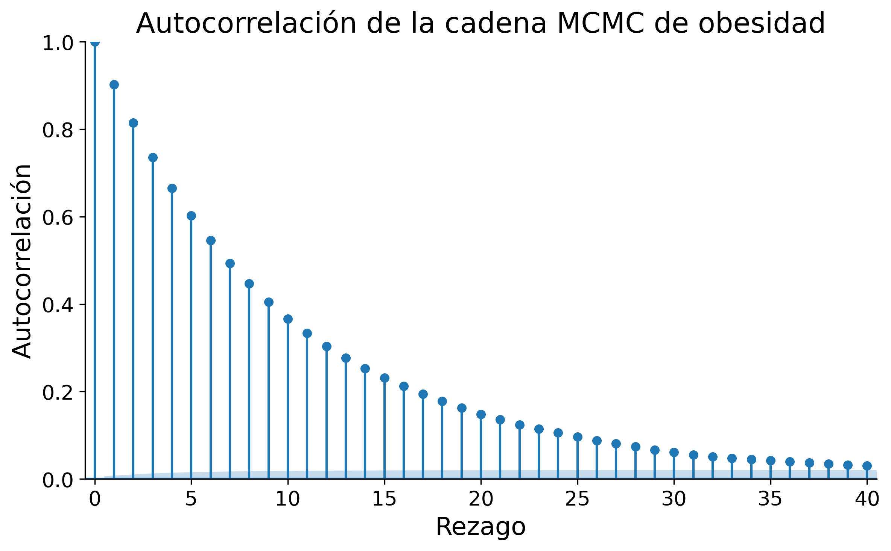
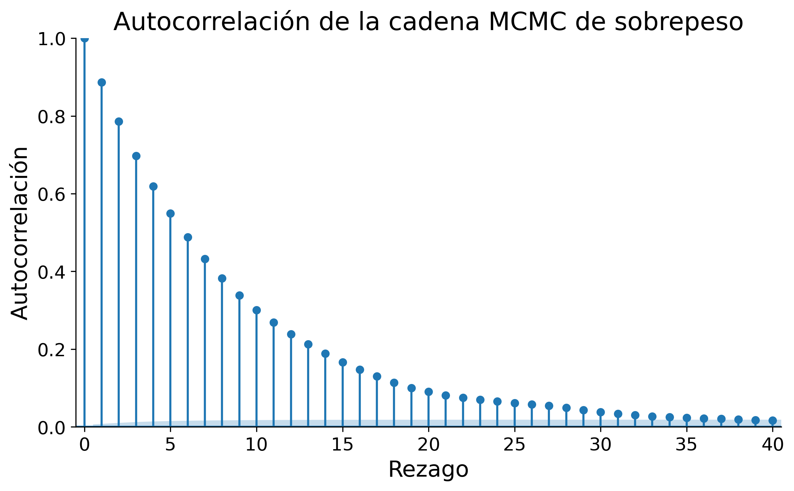
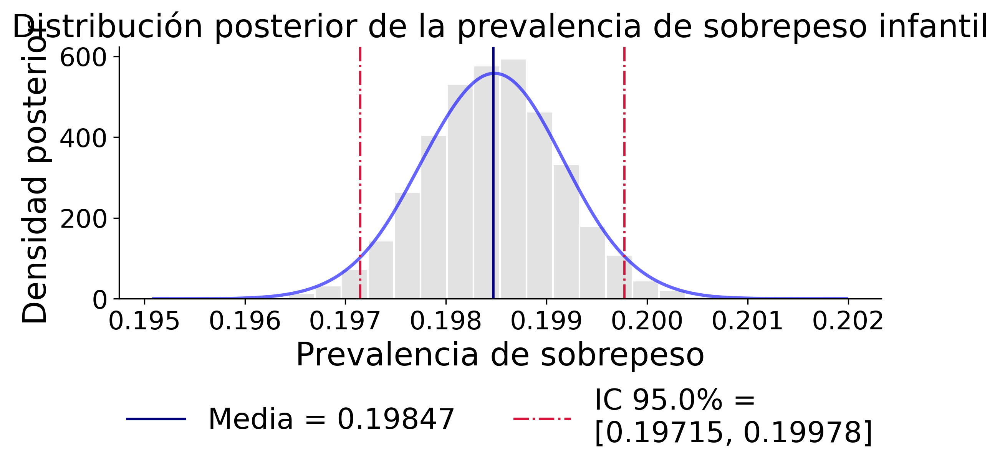
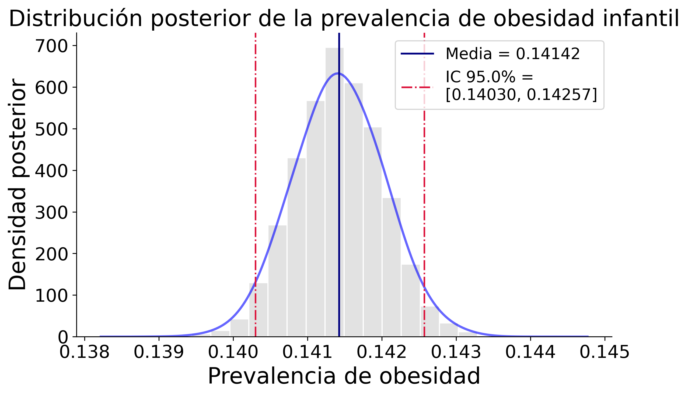

```{r setup, include=FALSE}
knitr::opts_chunk$set(echo = FALSE, message = FALSE, warning = FALSE)
```

# Introducción

El sobrepeso y la obesidad infantil se han establecido en las últimas décadas como una de las principales problemáticas de salud pública a nivel mundial. En tan solo cuatro décadas, la cantidad de niños y adolescentes en edad escolar con obesidad se multiplicó por más de diez, pasando de 11 millones a 124 millones, y se calculó que alrededor de 216 millones tenían sobrepeso en el 2016 [@WHO2018]. Entre los efectos tempranos de estas afecciones, se incluyen complicaciones respiratorias, alteraciones metabólicas y problemas psicosociales, mientras que en la adultez se asocia con mayor riesgo de enfermedades crónicas, discapacidad y mortalidad prematura [@Gamboa2021].

En Costa Rica, los resultados del Censo Escolar de Peso y Talla 2016 revelaron que más de un tercio de la población infantil en edad escolar presenta sobrepeso u obesidad [@Gomez2023], lo que muestra urgencia de comprender este fenómeno en su complejidad de factores. Del mismo modo en otros países de ingresos medios, el exceso de peso infantil no se distribuye de manera uniforme debido a factores demográficos, socioeconómicos y territoriales que influyen en la prevalencia y configuran escenarios particulares según la zona de residencia, el nivel de desarrollo del distrito o el tipo de centro educativo [@Gamboa2021].

La evidencia científica en Costa Rica ha informado de la magnitud del problema y de los factores que explican sus diferencias territoriales y sociales. @Gamboa2021 analizaron más de 347 000 escolares del Censo Nacional de Peso/Talla 2016, revelando que el 34 % de los niños presentaban exceso de peso, con mayor prevalencia en varones y en aquellos que asistían a escuelas privadas, vivían en zonas urbanas o en distritos con mayor desarrollo socioeconómico. Estos resultados contrastan con la tendencia vista en países desarrollados, donde la obesidad infantil se asocia más a niveles socioeconómicos bajos, lo que subraya la necesidad de analizar el fenómeno junto con el contexto nacional.

Por su parte, @Nunez2022 aportaron referencias nacionales de índice de masa corporal (IMC) y circunferencia de cintura (CC) para estudiantes de 7 a 17 años, mostrando que el 16,3 % de los escolares tenían obesidad y el 26,2 % sobrepeso. Sus hallazgos mostraron contradicciones con los patrones internacionales, lo que evidencia que el uso exclusivo de referencias externas podría distorsionar la prevalencia real en el país; lo que confirma que contar con curvas nacionales de crecimiento es una herramienta fundamental para el monitoreo y diseño de estrategias de salud pública.

En el ámbito regional, @Hernandez2016 evidenciaron en Perú cómo el sobrepeso y la obesidad infantil se concentran en distritos urbanos y costeros, mientras que las zonas andinas y amazónicas registran menores prevalencias. Dicho patrón geográfico refleja la transición nutricional que caracteriza a América Latina, donde coexisten problemas de desnutrición y exceso de peso, situación que hace más compleja la planificación de políticas públicas.

De manera más específica para Costa Rica, @Gomez2023 aplicaron un modelo espacial bayesiano para estimar la prevalencia distrital de obesidad infantil, encontrando asociaciones significativas con factores educativos, económicos y demográficos. Entre los resultados se identificó una relación no lineal con la escolaridad promedio, así como una mayor prevalencia en distritos urbanos, cabeceras de provincia, zonas turísticas y fronterizas con Panamá. Estos hallazgos muestran que los entornos sociales y territoriales influyen de manera decisiva en la distribución del sobrepeso y la obesidad infantil.

Este panorama motiva la siguiente pregunta de investigación: ¿cómo se distribuye territorialmente la prevalencia de sobrepeso y obesidad infantil en Costa Rica, y con qué grado de incertidumbre podemos estimarla a partir de la evidencia disponible? Para responderla, en este estudio adoptamos un enfoque bayesiano explícito en la cuantificación de la incertidumbre y nos proponemos, primero, estimar la distribución posterior de la prevalencia de sobrepeso y de obesidad en cada provincia mediante un modelo binomial bayesiano y métodos computacionales de inferencia; cuando corresponda, se emplearán algoritmos de muestreo eficientes como NUTS/HMC para garantizar una exploración adecuada del espacio posterior [@HoffmanGelman2014]. En segundo lugar, compararemos los resultados entre provincias, analizando medias posteriores e intervalos de credibilidad, con el fin de evaluar la heterogeneidad territorial. Finalmente, visualizaremos la prevalencia estimada y su incertidumbre posterior mediante mapas y gráficos que faciliten la interpretación y comunicación de los hallazgos a audiencias técnicas y de política pública.


*Palabras clave:* Costa Rica, sobrepeso, obesidad


## Marco Teórico (Preliminar)

### 1. Modelado bayesiano espacial para mapeo de enfermedad

El estudio de patrones geográficos de sobrepeso y obesidad mediante enfoques bayesianos espaciales permite estimar riesgos o prevalencias incorporando dependencia espacial y cuantificando la incertidumbre. En el contexto costarricense, se ha aplicado este enfoque para la prevalencia infantil, utilizando datos agregados a nivel distrital y complementando con variables socieconómicas, además de facilitar la visualización mediante un *dashboard* asociado al propio artículo. [@Gomez2023]

### 2. Modelos espaciales y control de complejidad

En el análisis espacial de enfermedades se emplean modelos jerárquicos que permiten separar efectos estructurados (dependencia espacial) y no estructurados (heterogeneidad), lo cual facilita la interpretación y el control de la complejidad. Este tipo de planteamientos provee una base formal para especificar hiperparámetros y para interpretar los componentes espaciales. [@Gelfand2010Handbook]

### 3. Marcos jerárquicos con estructura/no estructura espacial

El riesgo de obesidad puede modelarse en un esquema jerárquico que incorpore simultáneamente efectos estructurados (dependencia espacial) y no estructurados (heterogeneidad), en línea con modelos jerárquicos bayesianos aplicados en salud pública. [@Moraga2019Geospatial]

### 4. Covariables relevantes y diagnóstico espacial exploratorio

La literatura sobre obesidad infantil considera patrones de estilo de vida —por ejemplo, dieta, tiempo en pantalla, juego al aire libre, sueño y actividad física— y analiza su relación con el desarrollo del sobrepeso. Ello ilustra tanto la selección de covariables significativas como la incorporación de diagnósticos espaciales exploratorios. [@WHO2018]

### 5. Comparaciones con modelos de sobredispersión

En datos susceptibles de correlación espacial y conteo/tasas, es pertinente comparar modelos de sobredispersión con los modelos espaciales jerárquicos, utilizando criterios de comparación y diagnóstico. La evidencia empírica disponible muestra aplicaciones de estas comparaciones en contextos de salud pública. [@Moraga2020Sloth]

### 6. Evidencia contextual: determinantes socieconómicos y referencias antropométricas

En Costa Rica, se ha documentado la asociación entre nivel socieconómico (tipo de escuela, zona geográfica, nivel de desarrollo distrital) y exceso de peso en escolares, con una prevalencia total reportada del 34%, y mayor proporción en varones que en mujeres dentro de la muestra analizada. Además, se observa mayor probabilidad de exceso de peso en escuelas privadas, zonas urbanas y distritos más desarrollados. [@Gamboa2021]

Como referencia antropométrica nacional, se han estimado percentiles de IMC y circunferencia de cintura en población infanto-juvenil costarricense, reportando 16.3% de obesidad y 26.2% de sobrepeso en la muestra estudiada, y señalando discrepancias con referencias internacionales que pueden conducir a sobreestimación si se usan de forma exclusiva. [@Nunez2022]

### 7. Patrón espacial en la región: ejemplo del Perú

El análisis espacial del sobrepeso y la obesidad infantil en Perú (2014) identifica concentraciones regionales y clústeres distritales, con mayores tasas en zonas urbanas costeras y menores en regiones andinas y amazónicas, en el contexto de una transición nutricional con coexistencia de desnutrición y exceso de peso. [@Hernandez2016]

### 8. Fundamentos y referencias de estadística espacial

Los fundamentos metodológicos de procesos puntuales y de modelos con efectos aleatorios espaciales se encuentran sistematizados en obras de referencia que sirven como base conceptual y técnica para los enfoques anteriores, incluyendo aplicaciones geoespaciales y de estadística espacial aplicada. [@Gelfand2010Handbook; @Moraga2019Geospatial; @Moraga2023SpatialStats]

### 9. Síntesis operativa para el estudio propuesto

- El uso de marcos jerárquicos espaciales ofrece una parametrización interpretable de la estructura espacial y una guía para fijar hiperparámetros. [@Gelfand2010Handbook]
- La incorporación de efectos estructurados/no estructurados se alinea con desarrollos recientes aplicados al riesgo de obesidad. [@Moraga2019Geospatial]
- La selección de covariables puede apoyarse en evidencia sobre estilos de vida y determinantes socieconómicos, junto con diagnóstico espacial exploratorio. [@WHO2018; @Gamboa2021]
- La comparación con modelos de sobredispersión y la evaluación mediante criterios y diagnósticos son componentes metodológicos pertinentes. [@Moraga2020Sloth]
- En el caso costarricense, existen datos distritales y un *dashboard* asociado al estudio que facilitan la integración de información socieconómica y la comunicación de resultados. [@Gomez2023]
- Las referencias antropométricas nacionales pueden complementar o matizar las internacionales en la interpretación de resultados. [@Nunez2022]
- Evidencia regional adicional (Perú) muestra la utilidad del análisis espacial para identificar clústeres y gradientes geográficos. [@Hernandez2016]


## Descripción de los datos

La base de datos utilizada en este estudio contiene información sobre la prevalencia de sobrepeso y obesidad en distintos cantones de Costa Rica en el año 2016, junto con variables sociodemográficas y económicas relevantes. Los datos permiten analizar la distribución de la obesidad en la población y explorar posibles relaciones con factores sociales, educativos y de condiciones de vida en cada cantón. Se descartaron los valores faltantes, pues complejizaban la implementación metodológica.
Las variables consideradas en el análisis se describen a continuación:

- **distrito**: Nombre del distrito al que corresponde el registro.

- **provincia**: Nombre de la provincia correspondiente.

- **canton**: Nombre del cantón correspondiente. Representa la unidad territorial principal de análisis.

- **condicion**: Clasificación de los casos según el estado nutricional: sobrepeso, obesidad o combinada.

- **total**: Total de personas observadas.

- **subtotal**: Número de casos registrados por cantón dentro de cada categoría específica de condición.

- **prevalencia**: Porcentaje de la población del cantón que presenta sobrepeso, obesidad o ambas.

- **desempleo**: Porcentaje de personas desempleadas dentro del cantón.

- **poblacion_urbana**: Porcentaje de la población que reside en áreas urbanas del cantón.

- **privacion_critica**: Porcentaje de población en situación de privación crítica.

- **poblacion_menor_14**: Porcentaje de personas menores de 14 años en la población total del cantón.

- **hogares_monomarentales**: Porcentaje de hogares encabezados por un solo padre o madre.

- **ocupantes_por_hogar**: Promedio de personas que habitan en cada hogar del cantón.

- **anos_escolaridad**: Promedio de años de escolaridad alcanzados por la población, indicador del nivel educativo.

## Análisis exploratorio de la base de datos

La base de datos empleada contiene indicadores socioeconómicos y demográficos por distrito, así como medidas de prevalencia de sobrepeso y obesidad infantil. La fuente primaria de información es el Primer Censo Escolar Peso/Talla del 2016, una iniciativa que recolectó datos antropométricos de 347,379 niños entre 6 y 12 años pertenecientes al sistema escolar público y privado de Costa Rica. La información se encuentra desagregada en unidades administrativas (provincias, cantones y distritos). Para este estudio se seleccionaron los distritos como unidad de análisis, con el fin de aumentar la granularidad y captar mejor la heterogeneidad socioeconómica a ese nivel. Además, se asociaron métricas provenientes del Censo 2011, logrando un total de 472 territorios considerados.

En términos generales, la prevalencia combinada de sobrepeso y obesidad infantil muestra una media del 34%, con valores entre 13% y 56%, reflejando una variabilidad importante entre distritos. Al desagregar, la prevalencia de sobrepeso presenta un promedio de 20%, con una desviación estándar del 3% y un rango entre 6 y 33%, mientras que la prevalencia de obesidad registra un promedio de 14%, con desviación estándar del 4% y valores entre 0 y 33%. Estos resultados evidencian que, aunque ambas condiciones están presentes en magnitudes considerables, el sobrepeso es más frecuente que la obesidad, lo cual no es sorprendente al considerar que la obesidad se puede interpretar como un caso extremo de sobrepeso.

Los años de escolaridad promedio por distrito se sitúan en 8.1 años, con una dispersión moderada (sd ≈ 1.5). La tasa de desempleo es baja en promedio (3%), pero con algunos distritos alcanzando valores cercanos a 9%. El porcentaje de hogares monomarentales ronda el 20% y la privación crítica promedio de los hogares se ubica en 29%, mostrando casos extremos de hasta 90% La población urbana evidencia una clara polarización: muchos distritos son predominantemente rurales (0%) o completamente urbanos (100%).

Los histogramas permiten identificar distribuciones relativamente simétricas para variables como años de escolaridad, hogares monomarentales y ocupantes por hogar, mientras que otras como la población urbana y la privación crítica presentan asimetrías y valores extremos.

En cuanto a las asociaciones bivariadas, se observan patrones relevantes:

- Existe una relación positiva entre la prevalencia de sobrepeso/obesidad y los años de escolaridad promedio (los distritos con mayor escolaridad tienden a reportar mayor prevalencia).

- La relación con la tasa de desempleo es débil y ligeramente negativa, indicando que este factor no parece estar fuertemente vinculado con la prevalencia.

- El porcentaje de población urbana muestra una asociación positiva con la prevalencia, aunque con dispersión considerable.

Finalmente, al comparar por provincia, la prevalencia combinada oscila entre 30% en Limón y 37% en Heredia, siendo esta última la más alta. Los boxplots confirman una mayor heterogeneidad en provincias como San José y Alajuela, mientras que Cartago y Guanacaste presentan distribuciones más concentradas.

## Implementación Metodológica (preliminar)

### Enfoque Bayesiano
Dada la naturaleza de los datos, se modela el número total de casos observados en cada categoría (sobrepeso y obesidad, respectivamente) mediante una distribución $Y \sim \text{Binom}(N,p)$, donde $Y$ es el número total de casos, N el tamaño de la muestra y $p$ la probabilidad de pertenecer a la categoría de sobrepeso (o bien, obesidad) independientemente de la pertenencia cantonal o distrital. Desde un enfoque bayesiano, se asigna una distribución previa $\pi \sim \text{Beta}(1,1)$. De esta forma, se estima la prevalencia de obesidad y sobrepeso infantil en Costa Rica, a través del algoritmo Metropolis-Hastings.

<!--Al hacer esto, se obtienen los siguientes resultados:
%%,de forma preliminar mente estimar la prevala verosimilitud utilizada es una Binomial(total, p), y la previa a utilizar %es %Beta(1, 1). Con ello, se estima el p, es decir, la probabilidad de pertenecer a la categoría de obesidad o de %%sobrepeso, %independientemente del cantón al que se pertenece. Así, -->

### Autocorrelación
Para el método de Metropolis-Hasting, en ambos casos, se obtuvo una alta autocorrelación entre los elementos de la cadena, como se aprecia en las siguientes figuras.

```{r fig-autocorr_obesidad, echo=FALSE, fig.pos='H', fig.align='center', out.width='70%', fig.cap="Distribución posterior de la prevalencia de sobrepeso infantil"}

```

```{r fig-autocorr_sobrepeso, echo=FALSE, fig.pos='H', fig.align='center', out.width='70%', fig.cap="Distribución posterior de la prevalencia de sobrepeso infantil"}

```

### Histogramas
Una vez finalizado el proceso, se realizaron histogramas para visualizar la distribución posterior obtenida a partir de esta metodología. Además, se presenta la media y el intervalo de confianza para cada categoría.

```{r fig-sobpreso, echo=FALSE, fig.pos='H', fig.align='center', out.width='70%', fig.cap="Distribución posterior de la prevalencia de sobrepeso infantil"}

```


```{r fig-obesidad, echo=FALSE,fig.pos='H', fig.align='center', out.width='70%', fig.cap="Distribución posterior de la prevalencia de obesidad infantil"}

```


### Modelo de Regresión Binomial para prevalencia de sobrepeso, a nivel distrital.

Por su parte, se ajustó también un modelo de regresión binomial, con función de enlace logit, para modelar la prevalencia de sobrepeso en función de covariables sociodemográficas a nivel distrital. Específicamente, se considera como variable de respuesta, $Y_{i}$, la cantidad de casos observados de sobrepeso en el $i$-ésimo distrito, con una muestra total de \(n_i\):

\[
Y_i \sim Binomial(n_i, \pi_i), \quad
\text{logit}(\mathbb{E}(Y_{i}|\mathbf{X})) = \beta_0 + \beta_1 X_{1i} + \cdots + \beta_p X_{pi}
\]

Se incluyen las covariables: desempleo, población urbana, privación crítica, población menor de 14 años, hogares monomarentales, ocupantes por hogar y años de escolaridad. En la siguiente figura se presenta un resumen de las estimaciones de los coeficientes del modelo.

\begin{table}[h]
\centering
\caption{Resumen de los coeficientes del modelo binomial.}
\label{tab:coef_binom}
\begin{tabular}{lrrrr}
\toprule
\textbf{Variable} & \textbf{Estimate} & \textbf{Std. Error} & \textbf{z value} & \textbf{Pr(>|z|)} \\
\midrule
(Intercept)              & -1.540 & 0.1279 & -12.042 & $< 2\text{e-}16$ *** \\
desempleo                & -2.897 & 0.5001 & -5.793  & $6.93\text{e-}09$ *** \\
población\_urbana        &  0.059 & 0.0246 &  2.420  & 0.0155 * \\
privación\_critica       & -0.125 & 0.0789 & -1.592  & 0.1114 \\
población\_menor\_14     & -0.940 & 0.2175 & -4.321  & $1.55\text{e-}05$ *** \\
hogares\_monomarentales  & -0.009 & 0.1401 & -0.068  & 0.9457 \\
ocupantes\_por\_hogar    &  0.105 & 0.0234 &  4.507  & $6.58\text{e-}06$ *** \\
años\_escolaridad        &  0.012 & 0.0077 &  1.590  & 0.1117 \\
\bottomrule
\end{tabular}
\vspace{0.3em}
\footnotesize{Signif. codes: \textbf{0} ‘***’ \textbf{0.001} ‘**’ \textbf{0.01} ‘*’ \textbf{0.05} ‘.’ \textbf{0.1} ‘ ’ \textbf{1}}
\end{table}

En el modelo, resultan estadísticamente significativas las covariables de Desempleo, Población menor de 14 años, Ocupantes por hogar y Población urbana.Asimismo, el modelo es significativo con respecto al modelo nulo, por lo que las covariables incluidas explican parte de la variabilidad. Sin embargo, los diagnósticos indican la presencia de sobredispersión, con la razón $\text{Deviance/dof} = 1.914$. Por lo que el modelo no logra capturar en su totalidad la variabilidad de los datos.

### Modelo de Regresión Binomial Jerárquico.

En este estudio, la información se dispone a nivel distrital, la unidad geográficas más desagregada disponible. No obstante, los distritos están anidados dentro de cantones y provincias. Como lo señala la literatura consultada, es razonable asumir la existencia de correlación entre observaciones de una misma unidad geográfica superior. Por esta razón, se plantea el uso de modelos jerárquicos con efectos aleatorios que permitan incorporar la variablidad entre niveles

De forma análoga, sea \(Y_{ij}\) el número de casos de sobrepeso en el distrito \(i\) perteneciente a la unidad geográfica \(j\) (cantón o provincia), y  \(n_{ij}\) el total de individuos observados en dicho distrito. Se propone el siguiente modelo:

\[
Y_{ij} \sim \text{Binomial}(n_{ij}, \pi_{ij}), \qquad
\text{logit}(\mathbb{E}(\pi_{ij}|\mathbf{X}) = \beta_0 + \mathbf{X}_{i}^\top \boldsymbol\beta + u_j,
\]


donde \(u_{j}\) representa el efecto aleatorio asociado a la unidad geográfica superior $j$. Se asume que estos efectos aleatorios siguen una distribución normal con media cero y varianza común:
\[
u_j \sim \mathcal{N}(0, \sigma^2).
\]

En este sentido, se aplicaron los tests de Levene y Fligner-Killen, para valorar la hipótesis de igualdad de varianzas a nivel provincial. En el test Fligner-Killen, se rechaza al 5\% la hipótesis de igualdad de varianza de la logit prevalencia entre provincias, mientras que en el test de Levene no hay evidencia estadística suficiente para rechazar la hipótesis.

## Resultados

El objetivo principal es combinar información sociodemográfica y territorial para generar estimaciones ajustadas que reflejen la variabilidad tanto entre distritos como entre provincias, permitiendo comparar la prevalencia entre regiones de manera más robusta.

La metodología parte de una preparación de datos donde se filtran los registros según la condición de interés (por ejemplo, obesidad), se eliminan observaciones sin exposición (totales igual a cero) y se construyen las variables de respuesta `y` (casos observados) y `n` (población total). Además, se seleccionan y estandarizan variables sociodemográficas como desempleo, escolaridad, población urbana o número de ocupantes por hogar. Estas covariables se normalizan para que todas tengan media cero y desviación estándar uno, asegurando que los coeficientes del modelo sean comparables.

El modelo jerárquico utilizado es una regresión binomial con enlace logit, formulada como:
$$
y_i \sim \text{Binomial}(n_i, p_i), \quad \text{logit}(p_i) = \alpha + X_i \beta + u_j
$$
donde $u_j$ representa un efecto aleatorio provincial que captura la variabilidad no explicada por las covariables entre provincias. Este término jerárquico permite incorporar la estructura territorial en la estimación. Debido a la poca información previa disponible, se utilizaron previas débiles (en la escala logit) para los parámetros $\alpha, $\beta$ y $\sigma_u$ (desviación de los efectos provinciales).

La inferencia bayesiana se implementa con el paquete `PyMC`, que aplica técnicas de muestreo MCMC (Markov Chain Monte Carlo) para generar miles de simulaciones de la distribución posterior de los parámetros. El script ejecuta cuatro modelos principales: dos jerárquicos (con efectos provinciales) y dos no jerárquicos (sin efectos provinciales), tanto para obesidad como para sobrepeso, lo que permite evaluar el aporte de la estructura jerárquica en la explicación de la variabilidad y la precisión de las estimaciones.

Finalmente, el documento produce resúmenes y visualizaciones de las distribuciones posteriores. A partir de los valores simulados de $p_i$, se calculan las medias, medianas e intervalos de credibilidad al 95 % para cada distrito. Además, se obtienen estimaciones agregadas por provincia y para el país en general. Estas distribuciones se representan mediante histogramas y curvas de densidad suavizadas.

## Metodología

### Fuente de información

El análisis se sustenta en la base utilizada en el estudio de @Gamboa2021, construida a partir del Censo Escolar de Peso y Talla 2016 del Ministerio de Educación Pública de Costa Rica y variables complementarias de origen censal.
La estructura de esta base permite modelar, bajo un enfoque probabilístico binomial, el número de escolares con sobrepeso u obesidad en cada distrito del país.

### Población de estudio

La población está compuesta por niños y niñas matriculados en escuelas públicas y privadas costarricenses con registros antropométricos válidos. Cada observación representa un distrito educativo, agregando información sobre la cantidad de menores evaluados y aquellos con exceso de peso.

### Contexto temporal y espacial de los datos

Los datos corresponden al año 2016 y se organizan espacialmente por distrito y provincia.

### Métodos

#### Enfoque general y estructura del modelo

El estudio aplicó un modelo binomial con enlace logit, cuya formulación es:

$$
\text{logit}(p_i) = \alpha + X_i^{\top}\beta
$$

donde $\alpha$ es el intercepto global y $\beta$ el vector de coeficientes asociados a las covariables estandarizadas.
Los parámetros fueron estimados bajo un enfoque bayesiano, utilizando distribuciones previas débiles:

$$
\alpha, \beta_j \sim \mathcal{N}(0, 5)
$$
En el script usado, este modelo se implementa en la función `fit_model_binomial_logit()`
El bloque correspondiente define explícitamente la verosimilitud binomial (`pm.Binomial("y_obs", n=n, p=p, observed=y)`) y el enlace logit (`pm.math.sigmoid(lin)`), en coherencia con el planteamiento teórico.

#### Algoritmo de muestreo: NUTS

La inferencia bayesiana se realizó mediante el **No-U-Turn Sampler (NUTS)**, un algoritmo de tipo Hamiltonian Monte Carlo (HMC) que elimina la necesidad de fijar manualmente la longitud de trayectoria de las simulaciones.

Según @HoffmanGelman2014, NUTS “detecta de manera automática cuándo una trayectoria en el espacio de parámetros comienza a invertir su dirección (‘no-u-turn’), deteniendo el muestreo y garantizando un recorrido eficiente sin redundancia” (p. 3).
Esta propiedad lo convierte en una extensión adaptativa del método HMC, que aprovecha la información del gradiente de la verosimilitud para explorar con mayor eficiencia la distribución posterior.

En la práctica, NUTS emplea un integrador de salto (*leapfrog integrator*) para simular el movimiento de una partícula en el espacio de parámetros, guiada por el gradiente del logaritmo de la densidad posterior.
Cada iteración genera una trayectoria que se expande dinámicamente hasta alcanzar el punto donde la dirección del momento cambia de signo, condición en la que el algoritmo detiene la expansión (p. 10).
Esto garantiza que las cadenas no realicen trayectorias excesivamente largas ni cortas, evitando la autocorrelación elevada y mejorando la eficiencia del muestreo.

### Implementación en el script `modelo_jerarquico.py`

El muestreo NUTS fue ejecutado mediante la función `pm.sample()` del paquete PyMC, la cual implementa el algoritmo descrito por Hoffman y Gelman.
El bloque de código responsable de este proceso se encuentra en la función `fit_model_binomial_logit()` y adopta los siguientes parámetros:

```{r}
#| eval: false

trace = pm.sample(
    draws=2000,
    tune=1000,
    target_accept=0.9,
    chains=4,
    cores=4)

```


Cada elemento responde a una decisión metodológica específica:

- `draws=2000` y `tune=1000`: establecen 2000 muestras posteriores por cadena y 1000 iteraciones de ajuste (“burn-in”), de modo que el algoritmo pueda adaptar el tamaño de paso y la masa inercial antes de comenzar el muestreo efectivo.
@HoffmanGelman2014 recomiendan una fase de adaptation inicial en la que NUTS ajusta de forma iterativa el parámetro $\epsilon$ (step size) para alcanzar una tasa de aceptación deseada.

- `target_accept=0.9`: controla el criterio de aceptación de propuestas. Valores más altos reducen el riesgo de divergencias a costa de un mayor número de evaluaciones del gradiente, tal como se sugiere en la literatura sobre tuning adaptativo.

- `chains=4 y cores=4`: especifican la ejecución paralela de cuatro cadenas independientes, lo que permite evaluar la convergencia de manera robusta mediante el diagnóstico $\hat{R}$ de Gelman-Rubin.

El flujo completo implementado en `run_with_csv()` vincula estas funciones de la siguiente manera:

- Lectura y filtrado de datos (`prep_data()`), generando las matrices $y$, $n$ y $X_z$

- Ajuste del modelo logit-binomial mediante `fit_model_binomial_logit()` sin estructura jerárquica.

- Muestreo NUTS mediante `pm.sample()` con los parámetros descritos.

- Resumen de resultados (`posterior_summary_by_row()`), donde se calculan la media posterior y los intervalos de credibilidad del 95 %.

Este procedimiento traduce la teoría del muestreo hamiltoniano a una aplicación empírica concreta, cumpliendo con el principio de exploración eficiente del espacio posterior al que hace referencia @HoffmanGelman2014.

## Resultados

Los resultados obtenidos a partir del modelo binomial con enlace logit y muestreo NUTS evidencian un patrón claro en la distribución de la prevalencia de obesidad y sobrepeso infantil en Costa Rica, tanto a nivel nacional como provincial. En el plano nacional, la media posterior estimada para obesidad fue de 0.14143, con un intervalo de credibilidad del 95% entre 0.14023 y 0.14254. En el caso del sobrepeso, la media posterior fue de 0.19848, con un intervalo de credibilidad del 95% entre 0.19715 y 0.19983. Estos resultados, cuando se suman, permiten inferir que aproximadamente un 34% de la población infantil escolar del país presenta exceso de peso, cifra que confirma la magnitud del problema de salud pública y se encuentra alineada con las tendencias observadas en contextos internacionales. La Organización Mundial de la Salud @WHO2025 señala que “childhood obesity has become one of the most serious public health challenges of the 21st century”, al estimar que más de 390 millones de niños y adolescentes de entre 5 y 19 años en el mundo tienen sobrepeso u obesidad. Esta cifra global se sitúa en torno al 20% de esa población, lo que significa que Costa Rica presenta una proporción ligeramente superior al promedio global, aunque en consonancia con otros países de ingreso medio y urbano consolidado.

El modelo, basado en inferencia bayesiana con el algoritmo No-U-Turn Sampler (NUTS), generó distribuciones posteriores estables para cada provincia. En el caso de la obesidad, los resultados revelan un gradiente centro–periferia: San José, Heredia y Cartago muestran las mayores prevalencias medias (0.14870, 0.14804 y 0.14584 respectivamente), mientras que Guanacaste, Puntarenas y Limón presentan los valores más bajos (0.13516, 0.13037 y 0.12788). Este patrón se repite para el sobrepeso, con Heredia, Cartago y San José nuevamente en los primeros lugares (0.20765, 0.20648 y 0.20435 respectivamente) y Guanacaste y Puntarenas en los últimos (0.19067 y 0.18830). Las distribuciones posteriores provinciales presentan intervalos estrechos, lo que indica un grado alto de precisión en las estimaciones y una variabilidad relativamente moderada entre territorios.

Estos hallazgos coinciden con los resultados del análisis espacial bayesiano de @Gomez2023, quienes observaron que “las prevalencias más altas de sobrepeso y obesidad infantil se concentran en el Valle Central, en distritos cabecera de provincia y en zonas urbanizadas de mayor desarrollo económico”. Esta coherencia espacial reafirma que las condiciones urbanas y socioeconómicas más favorables, lejos de representar un factor protector, se asocian con mayores tasas de exceso de peso en las etapas iniciales de la transición nutricional. @Hernandez2016 observaron un fenómeno análogo en Perú, al documentar que “la obesidad infantil predomina en las zonas urbanas y la región costera del país, mientras que las regiones andinas y amazónicas registran prevalencias significativamente menores”. La similitud entre ambos países, pese a sus diferencias contextuales, refuerza la noción de que el exceso de peso infantil tiende a concentrarse en territorios con mayor desarrollo económico y urbano, en parte debido al acceso a alimentos ultraprocesados, al incremento del sedentarismo y a la reconfiguración de los entornos alimentarios.

La consistencia de las distribuciones posteriores nacionales y provinciales también se confirma cuando se comparan con las referencias antropométricas nacionales publicadas por @Nunez2022. En su estudio, los autores reportaron que “la prevalencia combinada de sobrepeso y obesidad alcanzó el 42.5% en escolares costarricenses, siendo la obesidad el principal problema nutricional de la niñez del país”. Aunque el presente modelo arroja una cifra ligeramente menor (≈34%), la diferencia se explica por la distinta definición de la muestra (nuestro estudio se limita a niños de 6-12 años medidos en el censo escolar) y por el uso de un enfoque probabilístico bayesiano que estima la prevalencia ajustada a covariables sociodemográficas. De cualquier modo, ambos resultados confirman que el exceso de peso en la infancia costarricense ha alcanzado niveles alarmantes y sostenidos en el tiempo.

A nivel global, los resultados nacionales obtenidos aquí se sitúan dentro del rango descrito por la evidencia más reciente. El Global Burden of Disease 2025 reportó que “the global prevalence of overweight and obesity among children and adolescents doubled between 1990 and 2021, with obesity alone tripling during that period” @GBD2025. Esa misma fuente proyecta que “by 2050, approximately 15% of younger children (5–14) and 14% of older adolescents (15–24) worldwide will have obesity”. En comparación, la prevalencia nacional de obesidad infantil en Costa Rica (14%) coincide exactamente con la estimación global proyectada, lo cual indica que el país se encuentra en plena convergencia con las tendencias internacionales. Esta coincidencia, sin embargo, no debe interpretarse como una normalización del fenómeno, sino como una señal de que la problemática ha adquirido rasgos estructurales similares a los observados en países de ingreso alto.

El World Obesity Atlas 2023 advierte que “childhood obesity could double from 2020 levels by 2035, reaching nearly 400 million children globally” @WorldObesity2023, lo que enmarca las cifras nacionales dentro de una tendencia mundial en expansión. Del mismo modo, @Zhang2024, en su metaanálisis publicado en JAMA Pediatrics, subrayan que “approximately one in five children and adolescents worldwide are now overweight or obese, a prevalence driven by combined behavioral, environmental, and socioeconomic factors”. Los resultados del presente estudio, que sitúan el sobrepeso en torno al 20%, reproducen con notable exactitud esa proporción, evidenciando la vigencia de los determinantes globales en el contexto costarricense.

A nivel institucional, las interpretaciones coinciden. La Organización Mundial de la Salud enfatiza que “the fundamental cause of obesity and overweight is an energy imbalance between calories consumed and calories expended” @WHO2025, una definición que engloba la interacción entre dieta, actividad física y entorno urbano. Por su parte, @UNICEF2023 describe la actual situación como “a global trap of unhealthy, ultra-processed foods combined with declining physical activity among children”, alertando sobre el papel del entorno alimentario industrializado. La convergencia de estas explicaciones con la distribución espacial de los resultados —prevalencias mayores en provincias urbanas y menores en costeras— sugiere que los procesos de urbanización y modernización alimentaria costarricenses han replicado las condiciones de ese “trap” descrito por UNICEF, especialmente en el área metropolitana central.

El análisis de los intervalos de credibilidad por provincia muestra que, aunque las diferencias absolutas son de pocos puntos porcentuales, la tendencia centro-periferia es sistemática y estadísticamente robusta. Heredia y San José se destacan con valores promedio de obesidad cercanos a 0.148 y sobrepeso superiores a 0.20, mientras que Puntarenas y Limón descienden a valores medios de 0.13 y 0.19, respectivamente. @Gomez2023 señalan que “el modelo bayesiano espacial confirmó la existencia de un patrón heterogéneo, con distritos de mayor riesgo en las zonas más urbanas del país”, lo que refuerza la interpretación de que el exceso de peso infantil se concentra en territorios de mayor densidad urbana y desarrollo económico. Esta diferenciación espacial también puede explicarse parcialmente por variaciones en la disponibilidad de alimentos frescos, la estructura de transporte y la exposición a publicidad alimentaria. Como sostiene la OMS, “urbanization and the shift towards more sedentary forms of recreation and work contribute significantly to rising obesity rates” @WHO2025.

Desde un punto de vista demográfico, los resultados revelan que la prevalencia combinada (sobrepeso + obesidad) ronda el 34%, lo que coloca a Costa Rica por encima del promedio latinoamericano y muy cerca de la media observada en países de la OCDE. El informe del @CDC2022 informa que “in the United States, the prevalence of obesity among children and adolescents aged 2–19 years was 19.7% in 2017–2020”, una cifra similar a la obtenida en nuestro estudio para obesidad infantil (14%). A pesar de las diferencias estructurales entre países, esta coincidencia cuantitativa sugiere que Costa Rica enfrenta un desafío sanitario comparable al de naciones desarrolladas, pero con recursos y capacidades institucionales más limitadas. En este sentido, los hallazgos se suman a la preocupación expresada por la OMS cuando advierte que “without intervention, the prevalence of obesity will continue to rise, leading to severe health and economic consequences” @WHO2025.

Si bien los resultados principales se refieren a la prevalencia provincial, el análisis posterior del modelo permite identificar consistencia interna entre sobrepeso y obesidad: las provincias con mayor sobrepeso tienden también a mostrar mayor obesidad, lo que evidencia la continuidad epidemiológica entre ambas condiciones. Esta continuidad es coherente con lo descrito en el Global Burden of Disease 2025, donde se advierte que “overweight in childhood frequently tracks into adult obesity, amplifying the long-term disease burden” @GBD2025. En este sentido, las estimaciones provinciales aquí presentadas no solo reflejan un estado actual, sino también el potencial acumulativo de riesgo futuro para la salud de la población infantil costarricense.

A pesar de las diferencias territoriales, el modelo muestra que la variabilidad interprovincial es relativamente limitada. Esto puede interpretarse como evidencia de un fenómeno generalizado a escala nacional, sustentado por determinantes compartidos: patrones alimentarios densos en energía, alta exposición a alimentos ultraprocesados y disminución progresiva de la actividad física. En la línea de @UNICEF2023, “the environments in which children live increasingly promote consumption of unhealthy foods and discourage physical activity”. Tal afirmación describe con precisión las condiciones observadas en las zonas metropolitanas costarricenses, donde la urbanización rápida y la densidad de establecimientos de comida rápida se han incrementado de forma sostenida durante las dos últimas décadas.

Los resultados nacionales y provinciales obtenidos confirman, por tanto, la existencia de una problemática estructural de salud pública en evolución. La convergencia con los hallazgos internacionales y regionales respalda la validez de las estimaciones del modelo y evidencia que el exceso de peso infantil costarricense forma parte de un fenómeno global de gran escala. Como sintetiza el @WorldObesity2023, “without bold policy action, no country is on track to meet the WHO target of halting the rise in obesity by 2025”. En este sentido, las estimaciones de este estudio no solo proporcionan una base empírica robusta para comprender la magnitud del problema en Costa Rica, sino también un punto de partida para el diseño de intervenciones públicas y escolares basadas en evidencia.

Finalmente, aunque el modelo aplicado es no jerárquico, los resultados obtenidos presentan consistencia y precisión aceptables en todos los niveles geográficos. La implementación del muestreo NUTS permitió explorar adecuadamente la distribución posterior de los parámetros, reduciendo la autocorrelación entre cadenas y garantizando convergencia. Esta estabilidad estadística refuerza la confianza en los valores reportados y su utilidad para la comparación con futuras estimaciones. No obstante, la literatura metodológica de @Gomez2023 recomienda, para etapas posteriores, incorporar componentes espaciales jerárquicos o modelos BYM2 que permitan captar dependencia geográfica residual y afinar las estimaciones provinciales en zonas con escasa información. En la actualidad, el modelo presentado proporciona una lectura clara, coherente y bien fundamentada del estado de la obesidad y el sobrepeso infantil en Costa Rica, situando al país dentro de la tendencia ascendente que preocupa a la comunidad internacional de salud pública.

## Referencias
