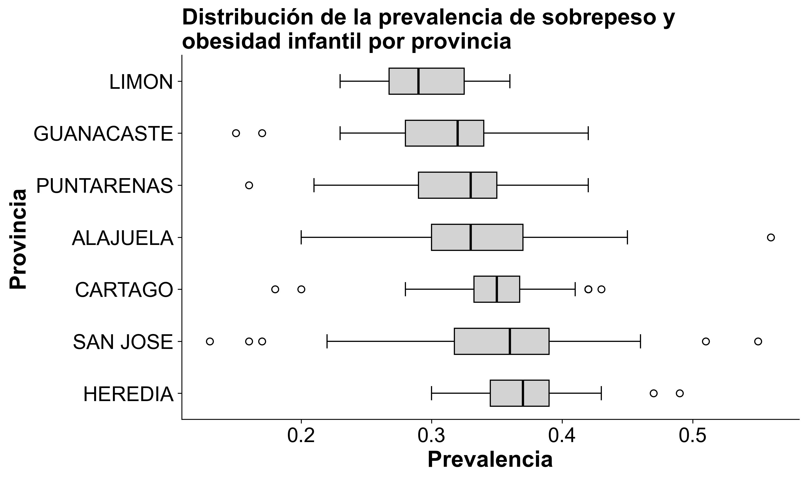
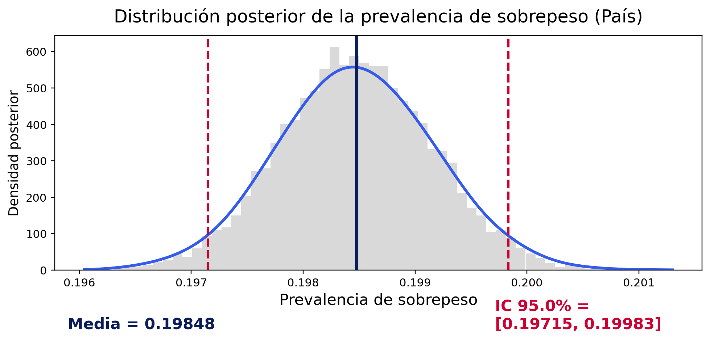
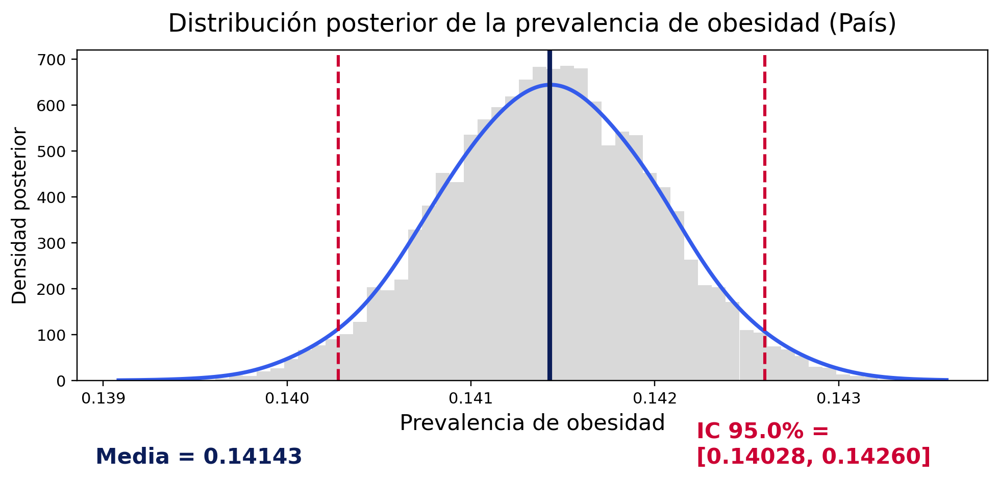

```{r setup, include=FALSE}
knitr::opts_chunk$set(echo = FALSE, message = FALSE, warning = FALSE)
```

# Resumen
Este estudio analiza la prevalencia de sobrepeso y obesidad infantil en Costa Rica a partir del Primer Censo Escolar de Peso/Talla 2016 (niños de 6 a 12 años). Se modelan los conteos de casos por cantón mediante un modelo binomial con enlace logit e inferencia bayesiana, incorporando covariables socioeconómicas y demográficas estandarizadas. La estimación se realiza con el algoritmo No-U-Turn Sampler (NUTS), que permite obtener distribuciones posteriores bien mezcladas para las probabilidades de prevalencia en cada unidad territorial. A nivel nacional, la media posterior de obesidad es cercana al 14 % y la de sobrepeso al 20 %, lo que implica un exceso de peso combinado de alrededor del 34 %. Se observa un gradiente centro–periferia: provincias y cantones del Valle Central presentan las prevalencias más elevadas, mientras que zonas costeras y periféricas muestran valores significativamente menores. Los resultados confirman que el exceso de peso infantil constituye un problema estructural de salud pública y muestran que el enfoque bayesiano logit–binomial es útil para cuantificar la prevalencia y su incertidumbre a distintos niveles geográficos.


*Palabras clave:* Costa Rica, sobrepeso, obesidad, muestreo NUTS.

# Introducción

El sobrepeso y la obesidad infantil se han consolidado en las últimas décadas como una de las principales problemáticas de salud pública a nivel mundial: entre 1975 y 2016 el número de niños y adolescentes con obesidad se multiplicó por más de diez, y más de 200 millones presentaban sobrepeso [@WHO2018]. Estas condiciones se asocian con complicaciones metabólicas y psicosociales en la niñez y con un mayor riesgo de enfermedad crónica, discapacidad y mortalidad prematura en la adultez [@Gamboa2021].

En Costa Rica, el primer Censo Escolar de Peso/Talla, desarrollado en el año 2016, reveló que más de un tercio de los escolares censados presenta exceso de peso [@Gomez2023]. Estudios nacionales han mostrado que la prevalencia de sobrepeso y obesidad es mayor en varones, en escuelas privadas y en distritos urbanos con mayor desarrollo socioeconómico [@Gamboa2021], así como también que las curvas nacionales de índice de masa corporal (IMC) y circunferencia de cintura difieren de los patrones internacionales [@Nunez2022]. Lo anterior subraya la necesidad de contar con referencias y análisis propios. A nivel regional, investigaciones como @Hernandez2016 para Perú, y @Gomez2023 para Costa Rica indican que el sobrepeso y la obesidad infantil tienden a concentrarse en territorios urbanos y costeros, evidenciando un componente territorial y socioeconómico en su distribución.

En este marco teórico, el problema se concibe como un fenómeno de prevalencia territorialmente heterogénea, influido por factores demográficos, económicos y de urbanización. Por esta razón, resulta necesario no solo estimar la magnitud de la prevalencia de sobrepeso y la obesidad, sino también cuantificar rigurosamente la incertidumbre asociada a esas estimaciones y describir su patrón espacial en el país.

Este panorama motiva la siguiente pregunta de investigación: ¿cómo se distribuye territorialmente la prevalencia de sobrepeso y obesidad infantil en Costa Rica, y con qué grado de incertidumbre puede estimarse a partir de la evidencia disponible? Para responderla, este estudio propone estimar la prevalencia de ambas condiciones en las distintas divisiones territoriales del país mediante un enfoque bayesiano. En particular, se modelan los conteos de casos utilizando un modelo binomial con enlace logit, al que se incorporan covariables sociodemográficas y se ajusta por medio de algoritmos de muestreo tipo HMC/NUTS [@HoffmanGelman2014] para aproximar la distribución posterior. A partir de estas distribuciones posteriores, se comparan provincias y cantones mediante medias e intervalos de credibilidad, y se elaboran mapas y gráficos que permiten interpretar la heterogeneidad territorial y la distribución de la prevalencia de sobrepeso y obesidad infantil en Costa Rica.

# Metodología
## Descripción de los datos

La base de datos empleada en este estudio corresponde al conjunto de datos construido en el marco del trabajo de @Gomez2023. En dicho estudio, los autores integran indicadores socioeconómicos y demográficos desagregados a nivel distrital procedentes del Censo Nacional de Población y Vivienda 2011, así como medidas de prevalencia de sobrepeso y obesidad infantil recolectadas en el Censo Escolar Peso/Talla 2016. Estos datos fueron obtenidos directamente a través del panel interactivo desarrollado por los autores.

La fuente primaria de información es el Censo Escolar Peso/Talla 2016, un operativo que recolectó datos de 347 379 niños entre 6 y 12 años matriculados en el sistema escolar público y privado de Costa Rica. Del total de población censada, 178 417 fueron hombres y 168 962 mujeres, lo que corresponde a un 51.3% y un 48.7% respectivamente. Asimismo, el censo alcanzó una cobertura cercana al 90.9% de la población objetivo, por lo que sus resultados se consideran estadísticamente representativos a nivel nacional (@CensoEscolar2016).

Las variables socioeconómicas y geográficas consideradas se describen a continuación:

- **distrito**: Nombre del distrito al que corresponde el registro.

- **provincia**: Nombre de la provincia correspondiente.

- **cantón**: Nombre del cantón correspondiente.

- **desempleo**: Porcentaje de personas desempleadas dentro del distrito

- **población_urbana**: Porcentaje de la población que reside en áreas urbanas del distrito

- **privación_crítica**: Porcentaje de población en situación de privación crítica.

- **población_menor_14**: Porcentaje de personas menores de 14 años en la población total del distrito

- **hogares_monomarentales**: Porcentaje de hogares encabezados por un solo padre o madre.

- **ocupantes_por_hogar**: Promedio de personas que habitan en cada hogar del distrito

- **años_escolaridad**: Promedio de años de escolaridad alcanzados por la población, indicador del nivel educativo.

Para seleccionar las variables más relevantes para su incorporación en el modelo, se aplicó un criterio de información AIC a partir de una regresión lineal preliminar sobre la prevalencia de sobrepeso y obesidad. Este procedimiento permitió identificar las covariables con mayor capacidad explicativa antes del ajuste bayesiano. En el caso del sobrepeso, las variables que mostraron mayor importancia fueron el desempleo, la población urbana, la privación crítica y la población menor de 14 años. Por su parte, para la obesidad las variables seleccionadas fueron el desempleo, la privación crítica, la población menor de 14 años y los años de escolaridad. Estas covariables constituyen la base del diseño del modelo logit–binomial empleado posteriormente.

Por otra parte, las variables de medición son las siguientes:

- **condición**: Clasificación de los registros según el estado nutricional de la persona estudiante: sobrepeso, obesidad, o combinada (exceso de peso).

- **total**: Total de personas censadas en cada distrito.

- **subtotal**: Número de casos registrados por distrito dentro de cada categoría específica de condición.

- **prevalencia**: Razón entre el número de casos (subtotal) y el total de personas censadas (total) para cada categoría.


## Análisis exploratorio de la base de datos

En términos generales, la prevalencia combinada de sobrepeso y obesidad infantil muestra una media del 34%, con valores que oscilan entre 13% y 56%, lo que refleja una variabilidad importante entre distritos. Al desagregar los datos por condición, la prevalencia de sobrepeso presenta un promedio de 20%, con una desviación estándar del 3% y un rango entre 6% y 33%, mientras que la prevalencia de obesidad registra un promedio de 14%, con desviación estándar del 4% y valores entre 0 y 33%. Estos resultados evidencian que, aunque ambas condiciones están presentes en magnitudes considerables, el sobrepeso es más frecuente que la obesidad, lo cual no es sorprendente al considerar que la obesidad se puede interpretar como un caso extremo de sobrepeso.

Los años de escolaridad promedio por distrito se sitúan en 8.1 años, con una desviación estándar moderada aproximadamente de $1.5$ años. La tasa de desempleo es baja en promedio (3%), pero para algunos distritos se alcanzan valores cercanos a 9%. El porcentaje de hogares monomarentales ronda el 20% y la privación crítica promedio de los hogares se ubica en 29%, mostrando casos extremos de hasta 90%. La población urbana evidencia una clara polarización, puesto que una cantidad considerable de distritos son predominantemente rurales (0%) o completamente urbanos (100%).

Finalmente, al comparar por provincia, la prevalencia combinada oscila entre 30% en Limón y 37% en Heredia, siendo esta última la más alta. En la Figura 1 se confirma una mayor heterogeneidad en provincias como San José y Alajuela, mientras que Cartago y Guanacaste presentan distribuciones más concentradas.

```{r fig-dist-combo, echo=FALSE, fig.pos='H', fig.align='center', out.width='70%', fig.cap="Distribución de la prevalencia de sobrepeso y obesidad infantil (distrital) por provincia"}

```
## Modelo: regresión binomial con enlace logit

Para poder responder la pregunta de investigación y explicar cómo cambia la prevalencia de sobrepeso y obesidad entre las diferentes zonas del país, en este estudio se utiliza un modelo binomial con enlace logit dentro de un enfoque bayesiano. Este modelo permite trabajar directamente con probabilidades a partir de los conteos de casos e incorporar variables sociodemográficas que podrían influir en estas prevalencias. Además, el enlace logit garantiza que las estimaciones se mantengan dentro del rango natural de una prevalencia, y el enfoque bayesiano facilita obtener distribuciones posteriores que reflejan explícitamente la incertidumbre asociada a cada territorio.

A partir de esta motivación, el modelo de regresión binomial con función de enlace logit describe los conteos de casos observados $y_i$ (subtotal) en el distrito $i$ sobre $n_i$, el total de niños censados en dicho distrito (total), mediante una verosimilitud binomial y un enlace logit para la esperanza de la prevalencia verdadera condicionada a las covariables, $p_{i}$ según:

\[
y_i \sim \mathrm{Binomial}(n_i, p_{i}),\qquad
\mathrm{logit}(p_i)=\eta_i=\alpha + X_i^\top\beta.
\]

donde $X_{i} = (x_{i,1}, \dots, x_{i,R})$ es el vector de covariables estandarizadas del distrito $i$, mientras que $\beta$ es el vector de coeficientes del modelo. Asimismo, la función logit viene dada por \(\mathrm{logit}(p)=\log\!\big(\tfrac{p}{1-p}\big)\) y su inversa corresponde a
\[
p_i=\frac{\exp(\eta_i)}{1+\exp(\eta_i)}.
\]
Condicionalmente en \(p_{i}\), la media y varianza de \(y_i\) son

\[
\mathbb E[y_i\mid p_{i}] = n_i p_{i},\qquad \mathrm{Var}(y_i\mid p_i)=n_i p_{i}(1-p_{i}).
\]

Desde un enfoque bayesiano, se asignan distribuciones previas a los parámetros de regresión. En particular, se considera

\[
\alpha \sim \mathcal{N}(0,5^{2}), \hspace{3mm} \beta_j\sim\mathcal N(0,5^{2}), \hspace{1.5mm} j = 1,...,R
\]

Esta distribución previa coloca aproximadamente el 95% de la masa en el intervalo [-9.8,9.8] para cada coeficiente. De esta forma, al considerar covariables estandarizadas, esta elección garantiza distribuciones previas débiles, puesto que abarca distintos órdenes de magnitud, y no impone una restricción significativa sobre la probabilidad base, ni los efectos de las covariables


### Interpretación e implementación del modelo.

En el modelo considerado, las covariables se encuentran estandarizadas, de modo que el vector $X_{i} = 0_{R}$ corresponde a un distrito cuyos valores en las covariables coinciden con sus medias muestrales. Así, el intercepto \(\alpha\) determina las log-odds de presentar la condición (sobrepeso, obesidad) en dicho distrito "promedio". Con esto, la prevalencia base asociada viene dada por  \(\mathrm{logit}^{-1}(\alpha) = 1/(1+e^{-\alpha})\).

A su vez, cada coeficiente \(\beta_{j}\) cuantifica el efecto de la covariable $j$-ésima sobre la prevalencia en la escala log-odds. Debido a la estandarización de las covariables, $\beta_{j}$ mide el cambio en log-odds asociado a un incremento de una desviación estándar en la covariable correspondiente, manteniendo el resto de covariables fijas. En términos de odds ratio, $\text{OR}_{j} = \exp(\beta_j)$ es el factor multiplicativo aplicado a las odds de presentar la condición cuando la covariable correspondiente aumenta en una desviación estándar, mientras se fijan el resto de covariables.

En este contexto, las cantidades $p_i$ describen la probabilidad de presentar la condición (sobrepeso, obesidad) en el distrito $i$, dado el perfil sociodemográfico capturado en el vector de covariables $X_{i}$. Asimismo, en el enfoque bayesiano adoptado, la información aportada por los datos y las distribuciones previas se combinan en la distribución posterior de $p_{i}$, a partir de la cual, se obtienen estimaciones puntuales, intervalos de credibilidad e indicadores agregados por cantón o provincia.

Debido a la complejidad de la fórmula exacta de la distribución posterior de los parámetros $\alpha$, $\beta$ del modelo, se recurre a aproximaciones numéricas mediante técnicas de muestreo Monte Carlo vía cadenas de Markov. En específico, en el presente estudio se utiliza el algoritmo No-U-Turn Sampler (NUTS), a través del software Python versión 3.8.2. Este procedimiento genera una cadena de valores $(\alpha^{(t)}, \beta^{(t)})$ cuya distribución estacionaria coincide con la distribución posterior de los coeficientes del modelo. Con esto, se generan muestras posteriores de la prevalencia $(p_{i}^{(t)})$ mediante el predictor lineal. El fundamento teórico de estos métodos se resume en la siguiente sección.

## Fundamento Teórico
### Hamiltonian Monte Carlo

Hamiltonian Monte Carlo (HMC) es un método de Monte Carlo por cadenas de Markov que introduce variables auxiliares de momento para transformar el muestreo de la distribución posterior \(p(\theta\mid y)\) en la integración de un sistema hamiltoniano. Se define la energía potencial \(U(\theta)=-\log p(\theta\mid y)\) y la energía cinética \(K(r)=\tfrac12 r^\top M^{-1} r\) para un vector de momentos \(r\) y una matriz de masa \(M\). La dinámica hamiltoniana preserva volumen y energía, y se aproxima con el integrador leapfrog, que usa un tamaño de paso \(\epsilon\) y un número de pasos \(L\) para proponer estados $\theta^*,r^*)$ alejados del estado actual, evitando la caminata aleatoria. La propuesta se corrige con un paso de aceptación Metropolis con probabilidad \(\min\{1,\exp[-\Delta H]\}\), donde \(\Delta H\) es el cambio en la energía debido a la discretización. Esta construcción aprovecha gradientes del log-posterior, permitiendo trayectorias largas con baja autocorrelación y alto tamaño efectivo de muestra por evaluación del gradiente. En la práctica, el rendimiento depende de sintonizar \(\epsilon\), \(L\) y \(M\); tamaños de paso demasiado grandes inducen divergencias, mientras que tamaños de paso muy pequeños incrementan el costo computacional. La literatura recomienda adaptar \(\epsilon\) hacia una tasa de aceptación objetivo y adaptar \(M\) (diagonal o densa) para adecuar la escala y curvatura del posterior, mejorando la estabilidad y la mezcla de la cadena [@HoffmanGelman2014].

### NUTS

El No-U-Turn Sampler (NUTS) es una extensión adaptativa de HMC que elimina la necesidad de fijar manualmente la longitud de trayectoria. En lugar de elegir un \(L\) fijo, NUTS expande dinámicamente la trayectoria (mediante un árbol binario) hasta detectar una no-u-turn: el punto en que la dirección del movimiento comienza a invertirse y proseguir añadiría recorrido redundante. Esta regla de detención garantiza trayectorias lo suficientemente largas para explorar eficientemente la masa de probabilidad, pero no tan largas como para desperdiciar cómputo, reduciendo la autocorrelación sin requerir sintonía manual de \(L\) [@HoffmanGelman2014, p. 3, p. 10]. En paralelo, NUTS emplea dual averaging para adaptar el tamaño de paso \(\epsilon\) hacia una tasa de aceptación objetivo (usualmente entre 0.8 y 0.95), lo que disminuye la incidencia de divergencias en posteriors con alta curvatura. En modelos con enlace logit y covariables estandarizadas —como el logit-binomial descrito— los gradientes están bien definidos y escalados, de modo que NUTS puede construir trayectorias estables que recorren el posterior con bajo error de integración y buena mezcla entre cadenas. La combinación de la expansión sin u-turn y la adaptación de \(\epsilon\) produce un muestreo eficiente y reproducible, con diagnósticos de convergencia favorables (\(\hat{R}\) cercano a 1 y tamaños efectivos altos), en línea con las recomendaciones metodológicas de @HoffmanGelman2014.


```{r}
### Resumen ejecutivo
#Es un modelo logit–binomial bayesiano con priors débiles; la inferencia usa NUTS (HMC) con adaptación automática para explorar eficientemente la posterior. El script estandariza covariables, selecciona un subconjunto mediante AIC, estima el modelo, resume $p_i$ por fila y agrega provincias/país ponderando por la exposición, además de graficar distribuciones posteriores comparables entre provincias. El resultado es un flujo reproducible para cuantificar prevalencias y su incertidumbre a distintos niveles territoriales, con métricas de desempeño que respaldan la calidad del ajuste. Como complemento a este informe, se desarrolló un dashboard interactivo, el cual se ejecuta de manera local dentro del entorno del proyecto de acuerdo a las instrucciones disponibles en el README del [repositorio](https://github.com/CA0307-II-2025/grupo-1)


```


# Resultados

Los resultados obtenidos a partir del modelo binomial con enlace logit y muestreo NUTS evidencian un patrón claro en la distribución de la prevalencia de obesidad y sobrepeso infantil en Costa Rica, tanto a nivel nacional como provincial. En el plano nacional, la media posterior estimada para obesidad fue de 0.14143, con un intervalo de credibilidad del 95% entre 0.14023 y 0.14254. En el caso del sobrepeso, la media posterior fue de 0.19848, con un intervalo de credibilidad del 95% entre 0.19715 y 0.19983.

```{r fig-mosaico_sobrepeso, echo=FALSE, fig.pos='H', fig.align='center', out.width='70%', fig.cap="Distribución posterior de la prevalencia de sobrepeso infantil a nivel país"}

```
```{r fig-mosaico_obesidad, echo=FALSE, fig.pos='H', fig.align='center', out.width='70%', fig.cap="Distribución posterior de la prevalencia de obesidad infantil a nivel país"}

```

Estos resultados, cuando se suman, permiten inferir que aproximadamente un 34% de la población infantil escolar del país presenta exceso de peso, cifra que confirma la magnitud del problema de salud pública y se encuentra alineada con las tendencias observadas en contextos internacionales. La Organización Mundial de la Salud @WHO2025 señala que “childhood obesity has become one of the most serious public health challenges of the 21st century”, al estimar que más de 390 millones de niños y adolescentes de entre 5 y 19 años en el mundo tienen sobrepeso u obesidad. Esta cifra global se sitúa en torno al 20% de esa población, lo que significa que Costa Rica presenta una proporción ligeramente superior al promedio global, aunque en consonancia con otros países de ingreso medio y urbano consolidado.

```{r resumen.provincias, echo=FALSE}
library(dplyr)
library(knitr)

read.csv("../res/csv/summary_prevalence_by_province.csv") %>%
  transmute(
    Grupo = stringr::str_to_title(Province),
    Media_Obesidad        = round(ob_mean, 5),
    `Intervalo Obesidad`  = paste0("[", round(ob_q2.5, 5),  ", ", round(ob_q97.5, 5),  "]"),
    Media_Sobrepeso       = round(sb_mean, 5),
    `Intervalo Sobrepeso` = paste0("[", round(sb_q2.5, 5), ", ", round(sb_q97.5, 5), "]")
  ) %>%
  kable(
    caption = "Resumen por provincia: obesidad y sobrepeso",
    col.names = c("Provincia", "Media Obesidad", "Intervalo Obesidad", "Media Sobrepeso", "Intervalo Sobrepeso"),
    align = "c"
  )

```

El modelo generó distribuciones posteriores estables para cada provincia. En el caso de la obesidad, los resultados revelan un gradiente centro–periferia: San José, Heredia y Cartago muestran las mayores prevalencias medias (0.14870, 0.14804 y 0.14584 respectivamente), mientras que Guanacaste, Puntarenas y Limón presentan los valores más bajos (0.13516, 0.13037 y 0.12788). Este patrón se repite para el sobrepeso, con Heredia, Cartago y San José nuevamente en los primeros lugares (0.20765, 0.20648 y 0.20435 respectivamente) y Guanacaste y Puntarenas en los últimos (0.19067 y 0.18830). A nivel cantonal, se observa un contraste similar: cantones periféricos como Talamanca (obesidad 0.10117; sobrepeso 0.17762), Buenos Aires, Los Chiles, La Cruz y Matina se sitúan en la cola inferior de la distribución, mientras que cantones del Gran Área Metropolitana como Heredia (0.15713; 0.21262), Santo Domingo, Moravia, Belén y Montes De Oca (0.16897; 0.22065) concentran las prevalencias medias más altas de obesidad y sobrepeso. @Gomez2023 señalan que “el modelo bayesiano espacial confirmó la existencia de un patrón heterogéneo, con distritos de mayor riesgo en las zonas más urbanas del país”, lo que refuerza la interpretación de que el exceso de peso infantil se concentra en territorios de mayor densidad urbana y desarrollo económico. Esta diferenciación espacial también puede explicarse parcialmente por variaciones en la disponibilidad de alimentos frescos, la estructura de transporte y la exposición a publicidad alimentaria. Como sostiene la @WHO2025, “urbanization and the shift towards more sedentary forms of recreation and work contribute significantly to rising obesity rates”.


```{r}
read.csv("../res/csv/summary_prevalence_by_canton.csv") %>%
  arrange(ob_mean) %>%
  filter(row_number() <= 5 | row_number() > n() - 5) %>%
  transmute(
    Grupo = stringr::str_to_title(Canton),
    Media_Obesidad        = round(ob_mean, 5),
    `Intervalo Obesidad`  = paste0("[", round(ob_q2.5, 5),  ", ", round(ob_q97.5, 5),  "]"),
    Media_Sobrepeso       = round(sb_mean, 5),
    `Intervalo Sobrepeso` = paste0("[", round(sb_q2.5, 5), ", ", round(sb_q97.5, 5), "]")
  ) %>%
  kable(
    caption = "Resumen por cantones más relevantes: obesidad y sobrepeso",
    col.names = c("Cantón", "Media Obesidad", "Intervalo Obesidad", "Media Sobrepeso", "Intervalo Sobrepeso"),
    align = "c"
  )
```

Estos hallazgos coinciden con los resultados del análisis espacial bayesiano de @Gomez2023, quienes observaron que “las prevalencias más altas de sobrepeso y obesidad infantil se concentran en el Valle Central, en distritos cabecera de provincia y en zonas urbanizadas de mayor desarrollo económico”. Esta coherencia espacial reafirma que las condiciones urbanas y socioeconómicas más favorables, lejos de representar un factor protector, se asocian con mayores tasas de exceso de peso en las etapas iniciales de la transición nutricional. @Hernandez2016 observaron un fenómeno análogo en Perú, al documentar que “la obesidad infantil predomina en las zonas urbanas y la región costera del país, mientras que las regiones andinas y amazónicas registran prevalencias significativamente menores”. La similitud entre ambos países, pese a sus diferencias contextuales, refuerza la noción de que el exceso de peso infantil tiende a concentrarse en territorios con mayor desarrollo económico y urbano, en parte debido al acceso a alimentos ultraprocesados, al incremento del sedentarismo y a la reconfiguración de los entornos alimentarios.

A nivel global, los resultados nacionales obtenidos aquí se sitúan dentro del rango descrito por la evidencia más reciente. @GBD2025 reportaron que “the global prevalence of overweight and obesity among children and adolescents doubled between 1990 and 2021, with obesity alone tripling during that period”. Esa misma fuente proyecta que “by 2050, approximately 15% of younger children (5–14) and 14% of older adolescents (15–24) worldwide will have obesity”. En comparación, la prevalencia nacional de obesidad infantil en Costa Rica (14%) coincide exactamente con la estimación global proyectada, lo cual indica que el país se encuentra en plena convergencia con las tendencias internacionales.

La @WorldObesity2023, por su parte, advierte que “childhood obesity could double from 2020 levels by 2035, reaching nearly 400 million children globally”, lo que enmarca las cifras nacionales dentro de una tendencia mundial en expansión. Del mismo modo, @Zhang2024 subrayan que “approximately one in five children and adolescents worldwide are now overweight or obese, a prevalence driven by combined behavioral, environmental, and socioeconomic factors”. Los resultados del presente estudio, que sitúan el sobrepeso en torno al 20%, reproducen con notable exactitud esa proporción, evidenciando la vigencia de los determinantes globales en el contexto costarricense.

A nivel institucional, las interpretaciones coinciden. La @WHO2025 enfatiza que “the fundamental cause of obesity and overweight is an energy imbalance between calories consumed and calories expended”, una definición que engloba la interacción entre dieta, actividad física y entorno urbano. Por su parte, @UNICEF2023 describe la actual situación como “a global trap of unhealthy, ultra-processed foods combined with declining physical activity among children”, alertando sobre el papel del entorno alimentario industrializado. La convergencia de estas explicaciones con la distribución espacial de los resultados —prevalencias mayores en provincias urbanas y menores en costeras— sugiere que los procesos de urbanización y modernización alimentaria costarricenses han replicado las condiciones de ese “trampa" descrita anteriormente, especialmente en el área metropolitana central.

Desde un punto de vista demográfico, los resultados revelan que la prevalencia combinada (sobrepeso + obesidad) ronda el 34%, lo que coloca a Costa Rica por encima del promedio latinoamericano y muy cerca de la media observada en países de la OCDE. El informe del @CDC2022 informa que “in the United States, the prevalence of obesity among children and adolescents aged 2–19 years was 19.7% in 2017–2020”, una cifra similar a la obtenida en nuestro estudio para obesidad infantil (14%). A pesar de las diferencias estructurales entre países, esta coincidencia cuantitativa sugiere que Costa Rica enfrenta un desafío sanitario comparable al de naciones desarrolladas, pero con recursos y capacidades institucionales más limitadas. En este sentido, los hallazgos se suman a la preocupación expresada por la OMS cuando advierte que “without intervention, the prevalence of obesity will continue to rise, leading to severe health and economic consequences” @WHO2025.

Si bien los resultados principales se refieren a la prevalencia provincial, el análisis posterior del modelo permite identificar consistencia interna entre sobrepeso y obesidad: las provincias con mayor sobrepeso tienden también a mostrar mayor obesidad, lo que evidencia la continuidad epidemiológica entre ambas condiciones. Esta continuidad es coherente con lo descrito por @GBD2025, donde se advierte que “overweight in childhood frequently tracks into adult obesity, amplifying the long-term disease burden”. En este sentido, las estimaciones provinciales aquí presentadas no solo reflejan un estado actual, sino también el potencial acumulativo de riesgo futuro para la salud de la población infantil costarricense.

Finalmente, el conjunto de resultados obtenidos permite delinear un panorama coherente sobre la distribución territorial y la magnitud del exceso de peso infantil en Costa Rica, mostrando cómo los patrones nacionales, provinciales y cantonales convergen con las tendencias regionales y globales descritas por la literatura. Esta coherencia interna y externa refuerza la solidez del modelo utilizado y prepara el terreno para, en el siguiente apartado, discutir las implicaciones prácticas y las orientaciones que pueden derivarse de estos hallazgos para la formulación de políticas públicas y acciones de salud preventiva.

# Conclusiones y recomendaciones

Los resultados de este estudio muestran que el exceso de peso infantil en Costa Rica es un problema de gran magnitud y con un patrón territorial claramente diferenciado. La prevalencia combinada cercana al 34 % ubica al país por encima del promedio latinoamericano y en niveles comparables a los de países de ingresos altos, lo que confirma que la transición nutricional costarricense presenta características avanzadas. Además, el gradiente centro–periferia identificado —con valores más altos en el Valle Central y menores en las zonas costeras y fronterizas— indica que el fenómeno no es uniforme, sino profundamente influido por factores urbanos, socioeconómicos y ambientales. Esta coherencia con estudios previos nacionales e internacionales refuerza la interpretación de que el exceso de peso infantil se concentra en territorios más urbanizados, donde la disponibilidad de alimentos ultraprocesados, los cambios en los patrones de movilidad y el sedentarismo desempeñan un papel cada vez más relevante.

Metodológicamente, el modelo logit–binomial ajustado mediante NUTS mostró buena convergencia y estabilidad en sus estimaciones, lo que respalda la confiabilidad de los resultados a nivel nacional, provincial y cantonal. No obstante, este enfoque presenta limitaciones importantes que deben ser reconocidas. En primer lugar, los datos utilizados corresponden únicamente al año 2016, por lo que el estudio no permite evaluar tendencias temporales ni posibles cambios recientes. En segundo lugar, el modelo no incorpora una estructura espacial jerárquica que capture dependencias territoriales residuales, por lo que parte de la variabilidad geográfica podría no estar completamente representada. También es necesario señalar que las covariables disponibles no reflejan dimensiones clave como la calidad del entorno alimentario, la infraestructura urbana o los niveles reales de actividad física en cada distrito, factores que podrían complementar y profundizar la explicación del fenómeno. Finalmente, dado que el análisis es ecológico, las inferencias se realizan a nivel territorial y no individual, por lo que no es posible establecer relaciones causales directas entre las características sociodemográficas y el estado nutricional de cada niño.

Aun con estas limitaciones, los hallazgos ofrecen una base sólida para orientar intervenciones públicas. Se recomienda priorizar acciones en cantones del Gran Área Metropolitana, donde las prevalencias son sistemáticamente más altas, mediante la mejora del entorno alimentario escolar, la regulación de productos ultraprocesados, la promoción de actividad física y la creación de espacios seguros para la movilidad activa. Al mismo tiempo, es importante mantener la vigilancia epidemiológica en zonas costeras y periféricas para evitar que las brechas territoriales se amplíen en el futuro. Asimismo, se sugiere fortalecer los sistemas de monitoreo nutricional y actualizar periódicamente análisis bayesianos como el desarrollado en este estudio, de modo que el país pueda disponer de estimaciones actualizadas para evaluar la efectividad de las políticas implementadas.

En conjunto, esta investigación evidencia que Costa Rica enfrenta un desafío nutricional relevante y complejo, pero también que cuenta con información robusta para diseñar estrategias basadas en evidencia que contribuyan a frenar el avance del sobrepeso y la obesidad infantil en los próximos años.

# Agradecimientos
Se agradece profundamente a nuestro profesor, PhD. Maikol Solís, por su orientación y apoyo durante todo el proceso de investigación. Su guía y consejos fueron fundamentales para que la realización de nuestro proyecto fuera posible. Estamos muy agradecidos por su dedicación, paciencia y tiempo brindado.

\newpage

# Bibliografía
<div id="refs"></div>

# Anexos

## Repositorio GitHub

En el siguiente enlace puede accesar el repositorio en Github del presente estudio: https://github.com/CA0307-II-2025/grupo-1

```{r}
read.csv("../res/csv/summary_prevalence_by_canton.csv") %>%
  transmute(
    Grupo = stringr::str_to_title(Canton),
    Media_Obesidad        = round(ob_mean, 5),
    `Intervalo Obesidad`  = paste0("[", round(ob_q2.5, 5),  ", ", round(ob_q97.5, 5),  "]"),
    Media_Sobrepeso       = round(sb_mean, 5),
    `Intervalo Sobrepeso` = paste0("[", round(sb_q2.5, 5), ", ", round(sb_q97.5, 5), "]")
  ) %>%
  kable(
    caption = "Resumen por cantones: obesidad y sobrepeso",
    col.names = c("Cantón", "Media Obesidad", "Intervalo Obesidad", "Media Sobrepeso", "Intervalo Sobrepeso"),
    align = "c"
  )
```
